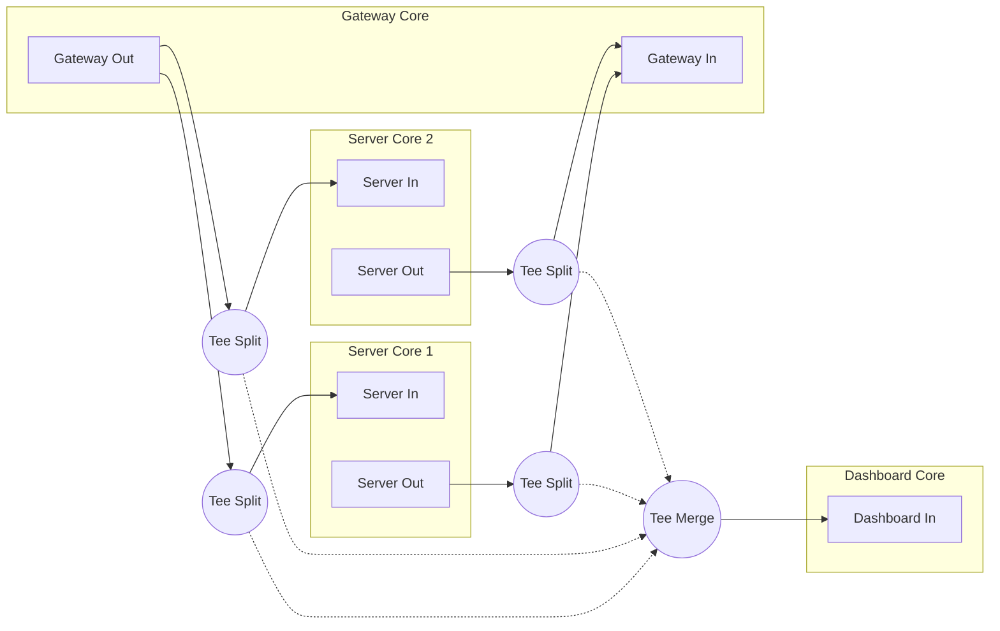

# MCP-MultiCore
An MCP Gateway implemented with PureMVC MultiCore and its Pipes Utility.

## Docs
* [Project Brief](docs/brief.md) 
* [Technical Specification (draft)](docs/spec-draft.md)

## Progress
* [x] Config-driven **Gateway**, **Dashboard**, and (multiple) **Server Cores** initialized and plumbed.
* [x] Front-end MCP Interface implemented in **Gateway Core**
* [x] All client requests being sent to the **Dashboard Core** and tracked in streams by Core and ClientId
* [x] STDIO servers configured for auto-connect are started, transports proxied, initialized, and their capabilities, info, instructions, and _meta are proxied.

## Next
The MCP Gateway Interface is currently a **WIP**: It works but only has an Echo tool for proof of concept.
Next steps are to implement tools to:
* [ ] List available servers 
* [ ] List tools on a server
* [ ] Invoke a tool
* [ ] List resources on a server
* [ ] Retrieve resource from a server
* [ ] List prompts on a server
* [ ] Get prompt from a server

# Meet The Cores
## Gateway Core
Exposes an MCP server interface for clients, offering tool discovery and calling, resource, prompts, tasks, implemented by configured servers.

## Dashboard Core
Receives all MCP message traffic as pipe messages, stores them in a proxy, accessible by Core and Client id.

Will have a dashboard web interface and / or an API for external access to the runtime MCP message traffic.
## Server Cores
For each configured MCP server, a Server Core is started, plumbed, and if so configured, its MCP server is initialized and its capabilities and stored in a proxy.

#  Core Plumbing
PureMVC systems are modular, with each "Core" being its own MVC application. 
Cores can message each other using the [Pipes utility](https://github.com/PureMVC/puremvc-typescript-util-pipes).

## Pipe Communications Characteristics
Each PureMVC Core has own isolated _intra-core_ notification space, where its actors communicate with each other.

The pipe utility adds an _inter-core_ notification space where schema-typed messages can be exchanged between one Core and another.

- Asynchronous: Message delivery does not block sender
- Typed: Messages follow a strict schema
- Programmable: Pipelines can contain filters, queues, splitting and merging tees, and more

## Pipe Topology
This diagram shows how the MCP MultiCore Gateway is plumbed.
- **Gateway Core** and each **Server Core** have mutual input and output pipes (bidirectional comms)
- **Dashboard Core** has only an input pipe (unidirectional comms)
- Pipes are _teed_; all messages passing bewteen **Gateway Core** and **Server Cores** are copied to the **Dashboard Core**



# Gateway Configuration
Configuration for all the Cores in the system is included in the **Gateway Core** configuration. 
The **Gateway Core** uses this to know what to instantiate and passes the individual configuration sections for the **Dashboard Core** and **Server Cores** to them as it starts them.

In `try-gateway.ts`, this working configuration is used to start the **Gateway Core**.
```json
{
  "gateway": {
	"port": 3001,
	"host": "localhost",
	"transport": "streamable-http"
  },
  "dashboard": {
	"port": 8080,
	"host": "localhost"
  },
  "servers": [
	{
	  "serverName": "server-everything",
	  "transport": "stdio",
	  "command": "npx",
	  "args": ["-y", "@modelcontextprotocol/server-everything"],
	  "autoConnect": true
	},
	{
	  "serverName": "server-filesystem",
	  "transport": "stdio",
	  "command": "npx",
	  "args": ["-y", "@modelcontextprotocol/server-filesystem"],
	  "autoConnect": false
	}
  ]
}
```
[

# Logging
## MCP Activity Logging
MCP message traffic is sent via pipe messages to the **Dashboard Core**, where it will be stored and accessible via a dashboard web interface and / or an API.

## System Logging
MCP Multicore Gateway operational log output is displayed on `STDERR` and is optimized to expose: 
* The order of operations at startup
* Ongoing runtime event-driven behavior
* Responsibilities of the various system actors
* How each actor is related to other actors
* Actual errors
]()

# System Tests
## Try Gateway
### `npm run try:gateway`
* Starts the **Gateway Core** with a simple configuration.
* The **Gateway Core** starts and plumbs the **Dashboard Core** and any configured **Server Cores**.
* An MCP server interface is available at `http://localhost:3001` for interacting with the system.

```
🔱 GatewayFacade - Preparing the Gateway Core
   📋 StartupGatewayCommand - Executing Gateway startup subcommands
      ⚙️ PrepareGatewayModelCommand - Preparing Gateway Model
         💾 GatewayConfigProxy - Registered with config
         💾 McpTransportsProxy - Registered
         ✔︎ Gateway Model prepared
      ⚙️ PrepareGatewayViewCommand - Preparing Gateway View
         🧩 GatewayJunctionMediator - Registered
         🧩 DashboardTeeMediator - Registered
         ✔︎ Gateway View prepared
      ⚙️ PlumbDashboardCommand - Create and Plumb Dashboard Core
         🔱 Dashboard Facade - Preparing the Dashboard Core
            📋 StartupDashboardCommand - Executing Dashboard startup subcommands
               ⚙️ PrepareDashboardModelCommand - Preparing Dashboard Model
                  💾 DashboardConfigProxy - Registered with config
                  💾 DashboardStreamsProxy - registered
                  ✔︎ Dashboard Model Prepared
               ⚙️ PrepareDashboardViewCommand - Preparing Dashboard View
                  🧩 DashboardJunctionMediator - Registered
                  ✔︎ Dashboard View prepared
               ⚙️ PrepareDashboardControllerCommand - Preparing Dashboard Controller
                  ✔︎ Dashboard Controller Prepared
               🧩 DashboardJunctionMediator - Accepting input pipe [from-everywhere]
               🧩 GatewayJunctionMediator - Accepting output pipe [to-dashboard]
         ✔︎ Dashboard Core plumbed
      ⚙️ PlumbServersCommand - Create and Plumb Server Cores
         🔱 ServerFacade - Preparing Server Core server-everything
            📋 StartupServerCommand - Executing Server startup subcommands
               ⚙️ PrepareServerModelCommand - Preparing Server Model for server-everything
                  💾 ServerConfigProxy - Registered with config for Core: server-everything
                  💾 ServerTransportProxy - Registered for Core: server-everything
                  ✔︎ Server Model prepared
               ⚙️ PrepareServerViewCommand - Preparing Server View for server-everything
                  🧩 ServerJunctionMediator - Registered
                  ✔︎ Server View prepared
               📋 ConnectMcpServerCommand - Auto-connecting MCP Server for server-everything
                  ⚙️ ConnectStdioServerCommand - Start STDIO server for server-everything
                  ✔︎ STDIO server connected for server-everything
                  ⚙️ CacheServerInfoCommand - Cache initialization result for server-everything
                     💾 CapabilitiesAndInfoProxy - Registered for Core: server-everything
                  ✔︎ Server info cached for server-everything
               🧩 GatewayJunctionMediator - Accepting output pipe [to-server-everything]
               🧩 ServerJunctionMediator - Accepting input pipe [from-gateway]
               🧩 GatewayJunctionMediator - Accepting input pipe [from-server-everything]
               🧩 ServerJunctionMediator - Accepting output pipe [to-gateway]
         ✔︎ Server Core server-everything plumbed
         🔱 ServerFacade - Preparing Server Core server-filesystem
            📋 StartupServerCommand - Executing Server startup subcommands
               ⚙️ PrepareServerModelCommand - Preparing Server Model for server-filesystem
                  💾 ServerConfigProxy - Registered with config for Core: server-filesystem
                  💾 ServerTransportProxy - Registered for Core: server-filesystem
                  ✔︎ Server Model prepared
               ⚙️ PrepareServerViewCommand - Preparing Server View for server-filesystem
                  🧩 ServerJunctionMediator - Registered
                  ✔︎ Server View prepared
               🧩 GatewayJunctionMediator - Accepting output pipe [to-server-filesystem]
               🧩 ServerJunctionMediator - Accepting input pipe [from-gateway]
               🧩 GatewayJunctionMediator - Accepting input pipe [from-server-filesystem]
               🧩 ServerJunctionMediator - Accepting output pipe [to-gateway]
         ✔︎ Server Core server-filesystem plumbed
         ✔︎ All Server Cores plumbed
      📋 StartMCPInterfaceCommand - Executing MCP Interface startup subcommands
         ⚙️ StreamableHttpTransportManagerCommand - Manage MCP Interface Streamable HTTP Transports
         ✔︎ Streamable HTTP Transport Manager started
            🎧 Streamable HTTP MCP Server listening on port 3001
```

## Try Dashboard
### `npm run try:dashboard`
* Starts only the **Dashboard Core** and sends it some test messages.
* Demonstrates how each Core can be started and interacted with independently.
```

         🔱 Dashboard Facade - Preparing the Dashboard Core
            📋 StartupDashboardCommand - Executing Dashboard startup subcommands
               ⚙️ PrepareDashboardModelCommand - Preparing Dashboard Model
                  💾 DashboardConfigProxy - Registered with config
                  💾 DashboardStreamsProxy - registered
                  ✔︎ Dashboard Model Prepared
               ⚙️ PrepareDashboardViewCommand - Preparing Dashboard View
                  🧩 DashboardJunctionMediator - Registered
                  ✔︎ Dashboard View prepared
               ⚙️ PrepareDashboardControllerCommand - Preparing Dashboard Controller
                  ✔︎ Dashboard Controller Prepared
               🧩 DashboardJunctionMediator - Accepting input pipe [to-dashboard]
               ⚙️ AddMessageToStreamCommand - Added to message stream in DashboardStreamsProxy.
                  🔍 Current stream length: 1
            🧩 DashboardJunctionMediator - dashboard core received: 
--------------------------------------------------------------------------------
{
  "type": "NORMAL",
  "header": {
    "core": "server-everything",
    "clientId": "1",
    "mcp-session-id": "1234567890",
    "Mcp-Protocol-Version": "2025-11-25"
  },
  "body": {
    "jsonrpc": "2.0",
    "id": 2,
    "method": "tools/call",
    "params": {
      "name": "get_weather",
      "arguments": {
        "location": "New York"
      }
    }
  },
  "priority": 1
}
--------------------------------------------------------------------------------
               ⚙️ AddMessageToStreamCommand - Added to message stream in DashboardStreamsProxy.
                  🔍 Current stream length: 1
            🧩 DashboardJunctionMediator - dashboard core received: 
--------------------------------------------------------------------------------
{
  "type": "NORMAL",
  "header": {
    "core": "gateway",
    "clientId": "1",
    "mcp-session-id": "1234567890",
    "Mcp-Protocol-Version": "2025-11-25"
  },
  "body": {
    "jsonrpc": "2.0",
    "id": 2,
    "result": {
      "content": [
        {
          "type": "text",
          "text": "Current weather in New York:\nTemperature: 72°F\nConditions: Partly cloudy"
        }
      ],
      "isError": false
    }
  },
  "priority": 1
}
-------------------------------------------------------------------------------

```
