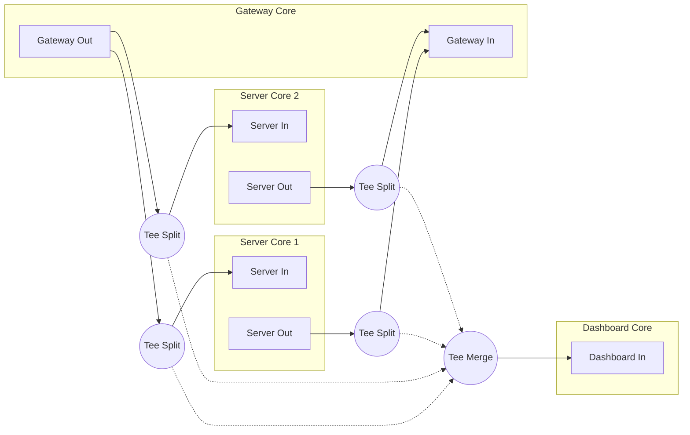

# MCP-MultiCore
An MCP Gateway Implemented with PureMVC MultiCore and Pipes

## Docs
* [Project Brief](docs/brief.md) 
* [Technical Specification (draft)](docs/spec-draft.md)

## Status
* Config-driven Gateway, Dashboard, and (multiple) Server Cores initialized and plumbed.
* Basic MCP Interface implemented in Gateway Core - (WIP, only has an echo tool for proof atm)
* All client requests being sent to the Dashboard Core and tracked in streams by core and clientId
* STDIO servers started in each server core and connected transports proxied.

## Next
* Auto-connect to each server and cache their capabilities and instructions
* Implement tools in Gateway MCP Interface to list servers list tools, resources, and prompts for a given server, invoke a tool on a server, etc

##  Pipe Topology
* PureMVC systems are modular, with each "Core" being its own MVC application.
* Cores can message each other using the [Pipes utility](https://github.com/PureMVC/puremvc-typescript-util-pipes).
* Pipelines can contain filters, queues, splitting and merging tees, and more.
* This diagram shows how the MCP MultiCore Gateway is plumbed.


### Pipe Characteristics:
- Bidirectional: Gateway and Server Cores have mutual input and output pipes
- Unidirectional: Dashboard has only an input pipe
- Tees: All pipes copy messages to Dashboard Core
- Asynchronous: Message delivery does not block sender
- Typed: Messages follow strict schema


## Try Gateway
### `npm run try:gateway`
Starts the **Gateway Core** with a simple configuration, which starts and plumbs the **Dashboard Core** and any configured **Server Cores**.

### Gateway Core 
Exposes an MCP server interface for clients, offering tool discovery and calling, resource, prompts, tasks, implemented by configured servers.


### Current Configuration
Hardcoded at the moment in `try-gateway.ts`, this demonstrates 
```json
{
  "gateway": {
	"port": 3001,
	"host": "localhost",
	"transport": "streamable-http"
  },
  "dashboard": {
	"port": 8080,
	"host": "localhost"
  },
  "servers": [
	{
	  "serverName": "server-everything",
	  "transport": "stdio",
	  "command": "npx",
	  "args": ["-y", "@modelcontextprotocol/server-everything"],
	  "autoConnect": true
	},
	{
	  "serverName": "server-filesystem",
	  "transport": "stdio",
	  "command": "npx",
	  "args": ["-y", "@modelcontextprotocol/server-filesystem"],
	  "autoConnect": false
	}
  ]
}
```

### Operational Logging
MCP Multicore Gateway operational log output is displayed on `STDERR` and is optimized to expose: 
* The order of operations at startup
* Ongoing runtime event-driven behavior
* Responsibilities of the various system actors
* How each actor is related to other actors
* Actual errors

```
🔱 GatewayFacade - Preparing the Gateway Core
   📋 StartupGatewayCommand - Executing Gateway startup subcommands
      ⚙️ PrepareGatewayModelCommand - Preparing Gateway Model
         💾 GatewayConfigProxy - Registered with config
         💾 McpTransportsProxy - Registered
         ✔︎ Gateway Model prepared
      ⚙️ PrepareGatewayViewCommand - Preparing Gateway View
         🧩 GatewayJunctionMediator - Registered
         🧩 DashboardTeeMediator - Registered
         ✔︎ Gateway View prepared
      ⚙️ PlumbDashboardCommand - Create and Plumb Dashboard Core
         🔱 Dashboard Facade - Preparing the Dashboard Core
            📋 StartupDashboardCommand - Executing Dashboard startup subcommands
               ⚙️ PrepareDashboardModelCommand - Preparing Dashboard Model
                  💾 DashboardConfigProxy - Registered with config
                  💾 DashboardStreamsProxy - registered
                  ✔︎ Dashboard Model Prepared
               ⚙️ PrepareDashboardViewCommand - Preparing Dashboard View
                  🧩 DashboardJunctionMediator - Registered
                  ✔︎ Dashboard View prepared
               ⚙️ PrepareDashboardControllerCommand - Preparing Dashboard Controller
                  ✔︎ Dashboard Controller Prepared
               🧩 DashboardJunctionMediator - Accepting input pipe [from-everywhere]
               🧩 GatewayJunctionMediator - Accepting output pipe [to-dashboard]
         ✔︎ Dashboard Core plumbed
      ⚙️ PlumbServersCommand - Create and Plumb Server Cores
         🔱 ServerFacade - Preparing Server Core server-everything
            📋 StartupServerCommand - Executing Server startup subcommands
               ⚙️ PrepareServerModelCommand - Preparing Server Model for server-everything
                  💾 ServerConfigProxy - Registered with config for Core: server-everything
                  💾 ServerTransportProxy - Registered for Core: server-everything
                  ✔︎ Server Model prepared
               ⚙️ PrepareServerViewCommand - Preparing Server View for server-everything
                  🧩 ServerJunctionMediator - Registered
                  ✔︎ Server View prepared
               📋 ConnectMcpServerCommand - Auto-connecting MCP Server for server-everything
                  ⚙️ ConnectStdioServerCommand - Start STDIO server for server-everything
                  ✔︎ STDIO server connected for server-everything
                  ⚙️ CacheServerInfoCommand - Cache initialization result for server-everything
                  ✔︎ Server info cached for server-everything
               🧩 GatewayJunctionMediator - Accepting output pipe [to-server-everything]
               🧩 ServerJunctionMediator - Accepting input pipe [from-gateway]
               🧩 GatewayJunctionMediator - Accepting input pipe [from-server-everything]
               🧩 ServerJunctionMediator - Accepting output pipe [to-gateway]
         ✔︎ Server Core server-everything plumbed
         🔱 ServerFacade - Preparing Server Core server-filesystem
            📋 StartupServerCommand - Executing Server startup subcommands
               ⚙️ PrepareServerModelCommand - Preparing Server Model for server-filesystem
                  💾 ServerConfigProxy - Registered with config for Core: server-filesystem
                  💾 ServerTransportProxy - Registered for Core: server-filesystem
                  ✔︎ Server Model prepared
               ⚙️ PrepareServerViewCommand - Preparing Server View for server-filesystem
                  🧩 ServerJunctionMediator - Registered
                  ✔︎ Server View prepared
               🧩 GatewayJunctionMediator - Accepting output pipe [to-server-filesystem]
               🧩 ServerJunctionMediator - Accepting input pipe [from-gateway]
               🧩 GatewayJunctionMediator - Accepting input pipe [from-server-filesystem]
               🧩 ServerJunctionMediator - Accepting output pipe [to-gateway]
         ✔︎ Server Core server-filesystem plumbed
         ✔︎ All Server Cores plumbed
      📋 StartMCPInterfaceCommand - Executing MCP Interface startup subcommands
         ⚙️ StreamableHttpTransportManagerCommand - Manage MCP Interface Streamable HTTP Transports
         ✔︎ Streamable HTTP Transport Manager started
            🎧 Streamable HTTP MCP Server listening on port 3001
```
