# MCP-Multicore Gateway Technical Specification

**Version:** 1.0  
**Date:** 2025-12-20  
**Status:** Draft

---

## Table of Contents

1. [System Overview](#1-system-overview)
2. [Architecture](#2-architecture)
3. [Initialization & Startup](#3-initialization--startup)
4. [Cache & Vector Search](#4-cache--vector-search)
5. [Authentication](#5-authentication)
6. [Client Session Management](#6-client-session-management)
7. [Message Routing](#7-message-routing)
8. [Monitoring & Observability](#8-monitoring--observability)
9. [Configuration](#9-configuration)
10. [Error Handling](#10-error-handling)
11. [Performance Considerations](#11-performance-considerations)

---

## 1. System Overview

### 1.1 Purpose

The MCP Gateway acts as an intelligent proxy and aggregator for multiple MCP (Model Context Protocol) servers. It presents itself as a single MCP server to clients while managing connections to multiple backend MCP servers. The gateway provides:

- **Discovery-based tool exposure**: Clients discover and register only the tools they need
- **Vector search**: Natural language search across all connected server capabilities
- **Authentication management**: Handles both gateway-level and client-specific authentication
- **Connection pooling**: Efficient management of client-server connections
- **Monitoring**: Observable system with dedicated monitoring core

### 1.2 Key Design Principles

1. **Client Isolation**: Each client has a completely isolated view of discovered tools/resources/prompts
2. **Lazy Discovery**: Capabilities are only registered when explicitly discovered by clients
3. **No Automatic Reconnection**: Failed server connections require manual intervention
4. **Cache-First Search**: Vector search operates on cached data, not live queries
5. **Streaming Resources**: Large resources stream through the gateway without buffering
6. **Persistent OAuth**: OAuth flows survive gateway restarts

---

## 2. Architecture

### 2.1 Multicore Structure

The gateway uses PureMVC Multicore pattern with the following cores:

**Gateway Core**:
- Single instance
- Manages client connections
- Routes requests to Server Cores
- Maintains global registry and vector search database

**Server Core** (one per configured MCP server):
- Isolated PureMVC Multicore instance
- Contains MCP Client SDK instance
- Manages connection to one MCP server
- Handles tool/resource/prompt invocations for that server

**Monitoring Core**:
- Single instance
- Receives copies of all inter-core messages
- Aggregates metrics and logs
- Implementation details TBD

### 2.2 Pipe Topology

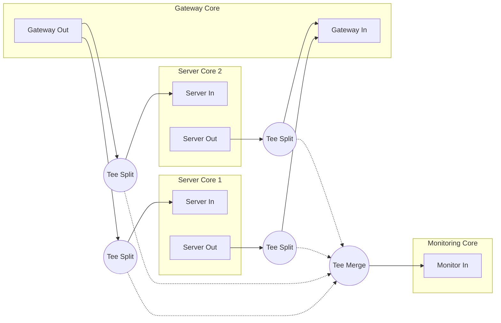
```mermaid
graph LR
    subgraph "Gateway Core"
        GW_OUT[Gateway Out]
        GW_IN[Gateway In]
    end
    
    subgraph "Server Core 1"
        SC1_IN[Server In]
        SC1_OUT[Server Out]
    end
    
    subgraph "Server Core 2"
        SC2_IN[Server In]
        SC2_OUT[Server Out]
    end
    
    subgraph "Monitoring Core"
        MON_IN[Monitor In]
    end
    
    %% Branching tees on the outbound and inbound paths
    %% One tee per link to avoid implying broadcast
    TEE_GW_SC1((Tee Split))
    TEE_GW_SC2((Tee Split))
    TEE_SC1_OUT((Tee Split))
    TEE_SC2_OUT((Tee Split))
    
    %% Tee Merge feeding the monitoring core
    TEE_MON((Tee Merge))
    
    %% Connect gateway outbound through branching tee to servers and monitor
    GW_OUT --> TEE_GW_SC1
    GW_OUT --> TEE_GW_SC2
    TEE_GW_SC1 --> SC1_IN
    TEE_GW_SC2 --> SC2_IN
    TEE_GW_SC1 -.-> TEE_MON
    TEE_GW_SC2 -.-> TEE_MON
    
    %% Connect server outs through branching tees to gateway in and monitor
    SC1_OUT --> TEE_SC1_OUT
    SC2_OUT --> TEE_SC2_OUT
    TEE_SC1_OUT --> GW_IN
    TEE_SC2_OUT --> GW_IN
    TEE_SC1_OUT -.-> TEE_MON
    TEE_SC2_OUT -.-> TEE_MON
    
    %% Tee Merge to monitoring core input
    TEE_MON --> MON_IN
```

**Pipe Characteristics**:
- Bidirectional: Each core pair has input and output pipes
- Teed: All pipes copy messages to Monitoring Core
- Asynchronous: Message delivery does not block sender
- Typed: Messages follow strict schema

### 2.3 Connection Architecture

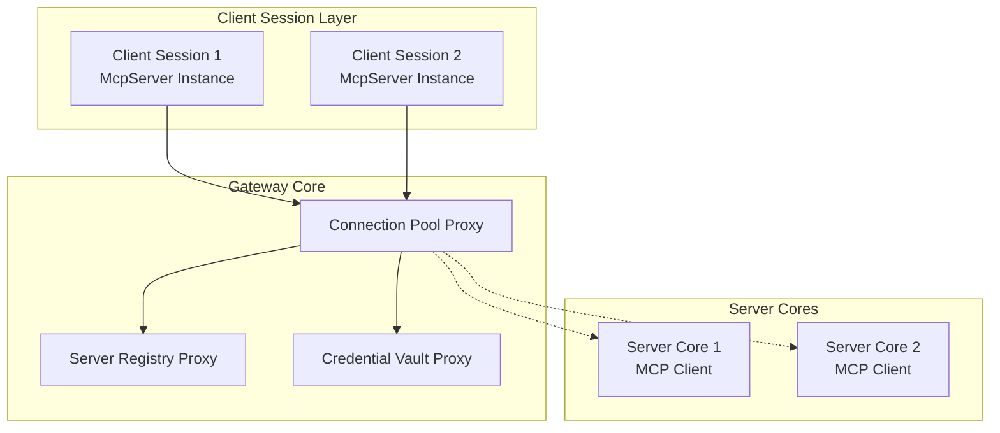
```mermaid
graph TB
    subgraph "Client Session Layer"
        CS1[Client Session 1<br/>McpServer Instance]
        CS2[Client Session 2<br/>McpServer Instance]
    end
    
    subgraph "Gateway Core"
        CP[Connection Pool Proxy]
        SR[Server Registry Proxy]
        CV[Credential Vault Proxy]
    end
    
    subgraph "Server Cores"
        SC1[Server Core 1<br/>MCP Client]
        SC2[Server Core 2<br/>MCP Client]
    end
    
    CS1 --> CP
    CS2 --> CP
    CP --> SR
    CP --> CV
    CP -.-> SC1
    CP -.-> SC2
```

**Connection Pool**:
- Key format: `${clientId}:${serverId}:${credentialHash}`
- Multiple clients can share gateway-auth connections
- Client-auth connections are isolated per client
- LRU eviction when pool limits exceeded

---

## 3. Initialization & Startup

### 3.1 Startup Sequence

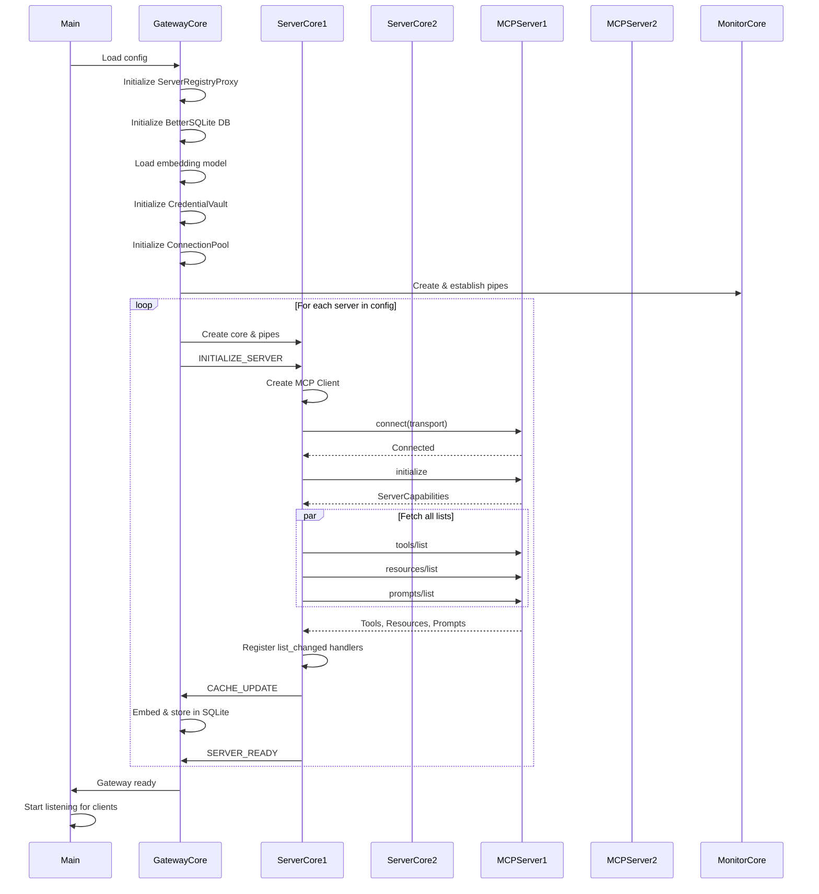
```mermaid
sequenceDiagram
    participant Main
    participant GatewayCore
    participant ServerCore1
    participant ServerCore2
    participant MCPServer1
    participant MCPServer2
    participant MonitorCore
    
    Main->>GatewayCore: Load config
    GatewayCore->>GatewayCore: Initialize ServerRegistryProxy
    GatewayCore->>GatewayCore: Initialize BetterSQLite DB
    GatewayCore->>GatewayCore: Load embedding model
    GatewayCore->>GatewayCore: Initialize CredentialVault
    GatewayCore->>GatewayCore: Initialize ConnectionPool
    
    GatewayCore->>MonitorCore: Create & establish pipes
    
    loop For each server in config
        GatewayCore->>ServerCore1: Create core & pipes
        GatewayCore->>ServerCore1: INITIALIZE_SERVER
        ServerCore1->>ServerCore1: Create MCP Client
        ServerCore1->>MCPServer1: connect(transport)
        MCPServer1-->>ServerCore1: Connected
        ServerCore1->>MCPServer1: initialize
        MCPServer1-->>ServerCore1: ServerCapabilities
        
        par Fetch all lists
            ServerCore1->>MCPServer1: tools/list
            ServerCore1->>MCPServer1: resources/list
            ServerCore1->>MCPServer1: prompts/list
        end
        
        MCPServer1-->>ServerCore1: Tools, Resources, Prompts
        
        ServerCore1->>ServerCore1: Register list_changed handlers
        ServerCore1->>GatewayCore: CACHE_UPDATE
        GatewayCore->>GatewayCore: Embed & store in SQLite
        ServerCore1->>GatewayCore: SERVER_READY
    end
    
    GatewayCore->>Main: Gateway ready
    Main->>Main: Start listening for clients
```

### 3.2 Initialization Steps

**Phase 1: Gateway Core Initialization**

1. Parse configuration file
2. Validate configuration schema
3. Initialize BetterSQLite databases:
    - Cache database (`cache.db`)
    - Credentials database (`credentials.db`)
    - OAuth state database (`oauth_state.db`)
4. Create database tables if not exist
5. Load Xenova embedding model (all-MiniLM-L6-v2)
6. Initialize CredentialVault with master key
7. Initialize ConnectionPoolProxy with config limits
8. Create ServerRegistryProxy
9. Create ClientConnectionProxy
10. Create OAuthProxy

**Phase 2: Monitoring Core Creation**

1. Create MonitorCore instance
2. Establish input pipe from Gateway Core
3. Set up tee connections for all future pipes
4. Initialize monitoring storage (implementation TBD)

**Phase 3: Server Core Creation** (for each server)

1. Generate unique server ID from config
2. Create new Multicore facade instance
3. Establish bidirectional pipes between Gateway and Server Core
4. Configure pipe tees to Monitoring Core
5. Send INITIALIZE_SERVER message via pipe with ServerConfig

**Phase 4: Server Connection** (within each Server Core)

1. Receive INITIALIZE_SERVER message
2. Create MCP Client SDK instance
3. Configure transport from ServerConfig:
    - **stdio**: Command, args, env
    - **sse**: URL, optional auth headers
    - **streamableHttp**: URL, optional auth headers
4. Apply gateway-level authentication if configured
5. Execute `client.connect(transport)`
6. Wait for connection establishment
7. Execute `client.initialize()` to get ServerCapabilities
8. Store capabilities locally

**Phase 5: Capability Caching** (within each Server Core)

1. Execute parallel requests:
    - `client.listTools()`
    - `client.listResources()`
    - `client.listPrompts()`
2. Wait for all responses
3. Build CACHE_UPDATE message with all data
4. Send CACHE_UPDATE to Gateway via pipe
5. If server supports `experimental.listChanged`:
    - Register handler for `notifications/tools/list_changed`
    - Register handler for `notifications/resources/list_changed`
    - Register handler for `notifications/prompts/list_changed`
6. Send SERVER_READY message to Gateway

**Phase 6: Vector Indexing** (within Gateway Core)

1. Receive CACHE_UPDATE from Server Core
2. For each tool:
    - Construct text: `"${tool.name}: ${tool.description}"`
    - Generate embedding via Xenova model
    - Store in `tool_embeddings` table
3. For each resource:
    - Construct text: `"${resource.name || resource.uri}: ${resource.description || ''}"`
    - Generate embedding
    - Store in `resource_embeddings` table
4. For each prompt:
    - Construct text: `"${prompt.name}: ${prompt.description || ''}"`
    - Generate embedding
    - Store in `prompt_embeddings` table
5. Update `server_metadata` table with server info
6. Mark server as "ready" in registry

**Phase 7: Client Listener Start**

1. Start transport listener based on gateway config:
    - **stdio**: stdin/stdout
    - **sse**: HTTP server on configured host/port
    - **streamableHttp**: HTTP server on configured host/port
2. Begin accepting client connections

### 3.3 Server Core Lifecycle States

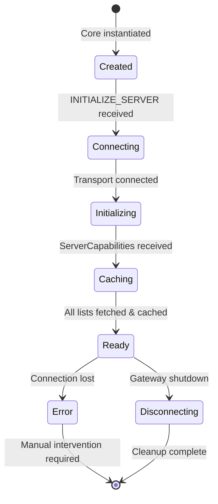
```mermaid
stateDiagram-v2
    [*] --> Created: Core instantiated
    Created --> Connecting: INITIALIZE_SERVER received
    Connecting --> Initializing: Transport connected
    Initializing --> Caching: ServerCapabilities received
    Caching --> Ready: All lists fetched & cached
    Ready --> Error: Connection lost
    Error --> [*]: Manual intervention required
    Ready --> Disconnecting: Gateway shutdown
    Disconnecting --> [*]: Cleanup complete
```

**State Definitions**:

- **Created**: Core exists, no connection attempted
- **Connecting**: Transport connection in progress
- **Initializing**: MCP handshake in progress
- **Caching**: Fetching tools/resources/prompts lists
- **Ready**: Operational, accepting requests
- **Error**: Connection failed, not operational
- **Disconnecting**: Graceful shutdown in progress

**State Transitions**:

- No automatic recovery from Error state
- Manual restart or reconfiguration required for recovery
- Gateway startup blocked until all servers reach Ready or Error state

---

## 4. Cache & Vector Search

### 4.1 Database Schema

**Database Files**:
- `cache.db`: Contains embeddings and server metadata
- `credentials.db`: Contains encrypted credentials
- `oauth_state.db`: Contains OAuth flow state

**cache.db Schema**:

```sql
-- Tool embeddings for vector search
CREATE TABLE tool_embeddings (
    id INTEGER PRIMARY KEY AUTOINCREMENT,
    server_id TEXT NOT NULL,
    tool_name TEXT NOT NULL,
    description TEXT,
    embedding BLOB NOT NULL,
    tool_data TEXT NOT NULL,
    indexed_at INTEGER NOT NULL,
    UNIQUE(server_id, tool_name)
);
CREATE INDEX idx_tool_server ON tool_embeddings(server_id);

-- Resource embeddings for vector search
CREATE TABLE resource_embeddings (
    id INTEGER PRIMARY KEY AUTOINCREMENT,
    server_id TEXT NOT NULL,
    resource_uri TEXT NOT NULL,
    resource_name TEXT,
    description TEXT,
    mime_type TEXT,
    embedding BLOB NOT NULL,
    resource_data TEXT NOT NULL,
    indexed_at INTEGER NOT NULL,
    UNIQUE(server_id, resource_uri)
);
CREATE INDEX idx_resource_server ON resource_embeddings(server_id);

-- Prompt embeddings for vector search
CREATE TABLE prompt_embeddings (
    id INTEGER PRIMARY KEY AUTOINCREMENT,
    server_id TEXT NOT NULL,
    prompt_name TEXT NOT NULL,
    description TEXT,
    embedding BLOB NOT NULL,
    prompt_data TEXT NOT NULL,
    indexed_at INTEGER NOT NULL,
    UNIQUE(server_id, prompt_name)
);
CREATE INDEX idx_prompt_server ON prompt_embeddings(server_id);

-- Server metadata
CREATE TABLE server_metadata (
    server_id TEXT PRIMARY KEY,
    name TEXT NOT NULL,
    description TEXT,
    capabilities TEXT NOT NULL,
    status TEXT NOT NULL,
    last_updated INTEGER NOT NULL,
    protocol_version TEXT,
    server_info TEXT
);

-- In-memory cache statistics
CREATE TABLE cache_stats (
    key TEXT PRIMARY KEY,
    value TEXT NOT NULL,
    updated_at INTEGER NOT NULL
);
```

### 4.2 Embedding Strategy

**Model Configuration**:
- Model: `Xenova/all-MiniLM-L6-v2`
- Size: ~23MB
- Dimensions: 384
- Pooling: mean
- Normalization: true

**Text Preparation**:

| Type | Format |
|------|--------|
| Tool | `"${tool.name}: ${tool.description}"` |
| Resource | `"${resource.name \|\| resource.uri}: ${resource.description \|\| ''}"` |
| Prompt | `"${prompt.name}: ${prompt.description \|\| ''}"` |

**Embedding Generation Process**:

1. Prepare text string from item
2. Pass to embedding model with options:
   ```typescript
   {
     pooling: 'mean',
     normalize: true
   }
   ```
3. Extract Float32Array from result
4. Convert to Buffer for storage
5. Store as BLOB in SQLite

**Storage Format**:
- Raw binary data (little-endian Float32 values)
- 384 floats × 4 bytes = 1,536 bytes per embedding
- No compression applied

### 4.3 Cache Update Strategy

**Initial Population**:

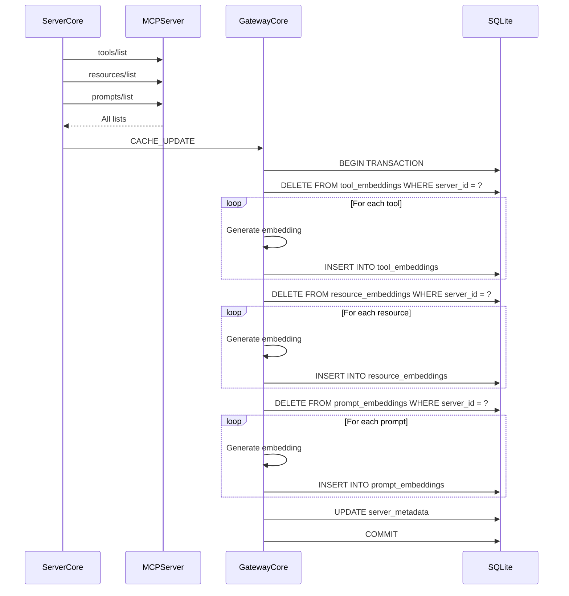
```mermaid
sequenceDiagram
    participant ServerCore
    participant MCPServer
    participant GatewayCore
    participant SQLite
    
    ServerCore->>MCPServer: tools/list
    ServerCore->>MCPServer: resources/list
    ServerCore->>MCPServer: prompts/list
    MCPServer-->>ServerCore: All lists
    ServerCore->>GatewayCore: CACHE_UPDATE
    GatewayCore->>SQLite: BEGIN TRANSACTION
    GatewayCore->>SQLite: DELETE FROM tool_embeddings WHERE server_id = ?
    loop For each tool
        GatewayCore->>GatewayCore: Generate embedding
        GatewayCore->>SQLite: INSERT INTO tool_embeddings
    end
    GatewayCore->>SQLite: DELETE FROM resource_embeddings WHERE server_id = ?
    loop For each resource
        GatewayCore->>GatewayCore: Generate embedding
        GatewayCore->>SQLite: INSERT INTO resource_embeddings
    end
    GatewayCore->>SQLite: DELETE FROM prompt_embeddings WHERE server_id = ?
    loop For each prompt
        GatewayCore->>GatewayCore: Generate embedding
        GatewayCore->>SQLite: INSERT INTO prompt_embeddings
    end
    GatewayCore->>SQLite: UPDATE server_metadata
    GatewayCore->>SQLite: COMMIT
```

**Incremental Update (list_changed)**:

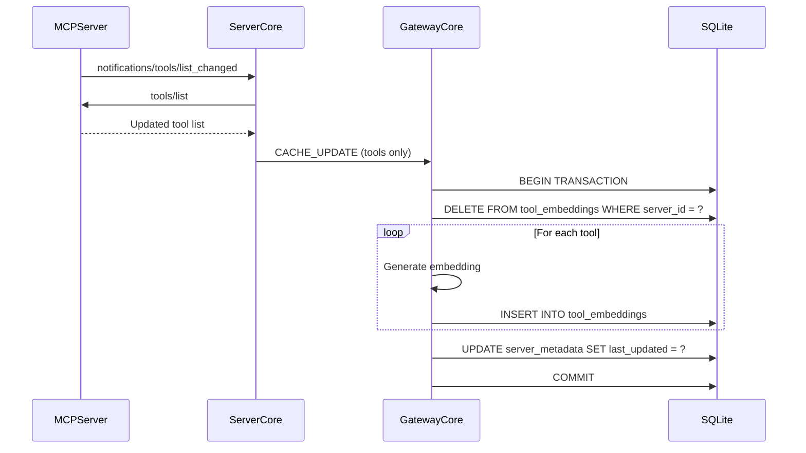
```mermaid
sequenceDiagram
    participant MCPServer
    participant ServerCore
    participant GatewayCore
    participant SQLite
    
    MCPServer->>ServerCore: notifications/tools/list_changed
    ServerCore->>MCPServer: tools/list
    MCPServer-->>ServerCore: Updated tool list
    ServerCore->>GatewayCore: CACHE_UPDATE (tools only)
    GatewayCore->>SQLite: BEGIN TRANSACTION
    GatewayCore->>SQLite: DELETE FROM tool_embeddings WHERE server_id = ?
    loop For each tool
        GatewayCore->>GatewayCore: Generate embedding
        GatewayCore->>SQLite: INSERT INTO tool_embeddings
    end
    GatewayCore->>SQLite: UPDATE server_metadata SET last_updated = ?
    GatewayCore->>SQLite: COMMIT
```

**Update Rules**:
- Always delete all existing entries for server before insert
- Use transactions for atomicity
- No incremental updates (full list replacement)
- Update `server_metadata.last_updated` timestamp

**Rationale for Full Replacement**:
- MCP protocol doesn't specify which items changed
- Avoids orphaned entries from deleted items
- Simpler implementation
- Acceptable performance for typical list sizes (< 1000 items)

### 4.4 Vector Search Algorithm

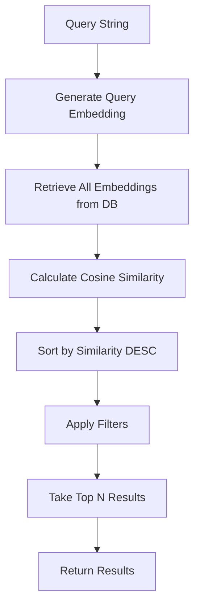
```mermaid
graph TD
    A[Query String] --> B[Generate Query Embedding]
    B --> C[Retrieve All Embeddings from DB]
    C --> D[Calculate Cosine Similarity]
    D --> E[Sort by Similarity DESC]
    E --> F[Apply Filters]
    F --> G[Take Top N Results]
    G --> H[Return Results]
```

**Search Process**:

1. **Query Embedding**:
    - Generate embedding for query string
    - Use same model/settings as indexing
    - Convert to Float32Array

2. **Similarity Calculation**:
   ```
   For each stored embedding:
     similarity = cosineSimilarity(queryEmbedding, storedEmbedding)
   
   cosineSimilarity(A, B) = (A · B) / (||A|| * ||B||)
   where:
     A · B = Σ(A[i] * B[i])  (dot product)
     ||A|| = √(Σ(A[i]²))      (magnitude)
     ||B|| = √(Σ(B[i]²))      (magnitude)
   ```

3. **Filtering**:
    - Apply `minSimilarity` threshold (default: 0.3)
    - Filter by `serverIds` if provided
    - Filter by authentication status if needed

4. **Ranking**:
    - Sort by similarity score descending
    - Take top `limit` results (default: 10, max: 50)

5. **Result Format**:
   ```typescript
   {
     serverId: string
     serverName: string
     itemType: 'tool' | 'resource' | 'prompt'
     itemName: string
     description: string
     similarity: number  // 0.0 to 1.0
     requiresAuth: boolean
     authStrategy: 'gateway' | 'client' | 'optional'
   }
   ```

**Search Performance**:
- In-memory operation after database read
- O(n) similarity calculation where n = number of items
- Typical search time: < 100ms for 1000 items
- No indexes needed (full table scan acceptable)

---

## 5. Authentication

### 5.1 Authentication Strategies

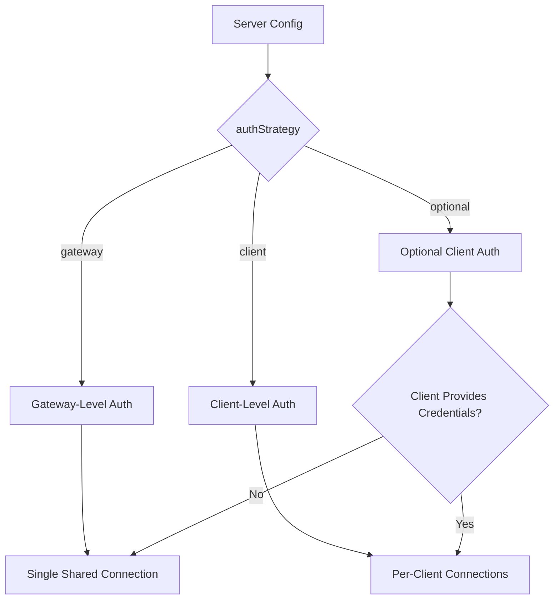
```mermaid
graph TD
    A[Server Config] --> B{authStrategy}
    B -->|gateway| C[Gateway-Level Auth]
    B -->|client| D[Client-Level Auth]
    B -->|optional| E[Optional Client Auth]
    
    C --> F[Single Shared Connection]
    D --> G[Per-Client Connections]
    E --> H{Client Provides Credentials?}
    H -->|Yes| G
    H -->|No| F
```

**Strategy: gateway**
- Credentials stored in configuration
- Single connection shared by all clients
- Used for: Internal tools, shared resources, read-only APIs
- Connection established at startup
- No per-client authentication required

**Strategy: client**
- Each client must provide credentials
- Separate connection per (clientId, serverId) pair
- Used for: User-specific APIs, SaaS services with user tokens
- Connection created on first discovery
- Credentials stored encrypted in CredentialVault

**Strategy: optional**
- Gateway has fallback credentials
- Client can override with own credentials
- Fallback to gateway connection if client doesn't provide auth
- Used for: Elevated permissions, flexible access patterns

### 5.2 Authentication Types

**API Key**:
```typescript
{
  type: 'api_key'
  apiKey: string
  apiKeyHeader?: string     // Default: "Authorization"
  apiKeyPrefix?: string     // Default: "Bearer"
}
```

Applied to transport as HTTP header:
```
Authorization: Bearer ${apiKey}
```

**Bearer Token**:
```typescript
{
  type: 'bearer'
  token: string
}
```

Applied as:
```
Authorization: Bearer ${token}
```

**Basic Authentication**:
```typescript
{
  type: 'basic'
  username: string
  password: string
}
```

Applied as:
```
Authorization: Basic ${base64(username:password)}
```

**OAuth 2.0**:
```typescript
{
  type: 'oauth'
  access_token: string
  refresh_token?: string
  token_type: string         // Usually "Bearer"
  expires_in?: number        // Seconds until expiration
  scope?: string
}
```

Applied as:
```
Authorization: ${token_type} ${access_token}
```

### 5.3 OAuth 2.0 Flow

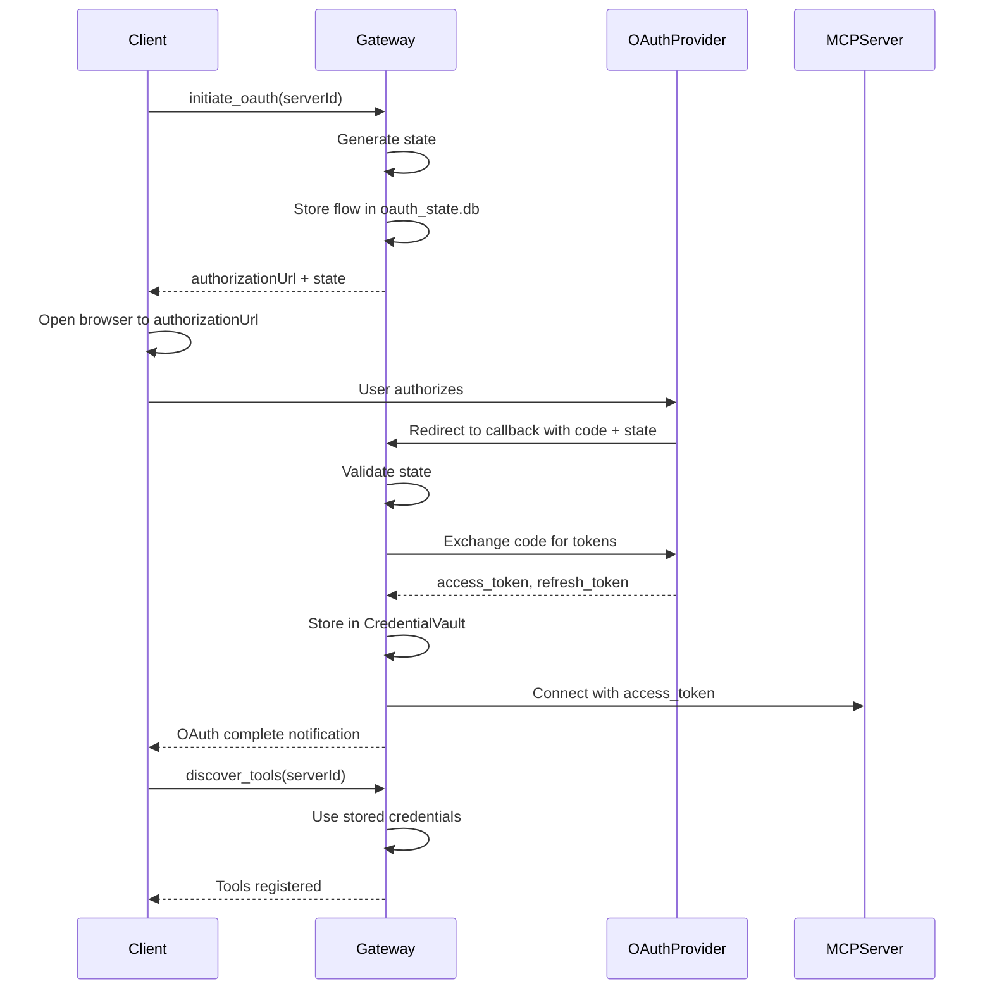
```mermaid
sequenceDiagram
    participant Client
    participant Gateway
    participant OAuthProvider
    participant MCPServer
    
    Client->>Gateway: initiate_oauth(serverId)
    Gateway->>Gateway: Generate state
    Gateway->>Gateway: Store flow in oauth_state.db
    Gateway-->>Client: authorizationUrl + state
    Client->>Client: Open browser to authorizationUrl
    Client->>OAuthProvider: User authorizes
    OAuthProvider->>Gateway: Redirect to callback with code + state
    Gateway->>Gateway: Validate state
    Gateway->>OAuthProvider: Exchange code for tokens
    OAuthProvider-->>Gateway: access_token, refresh_token
    Gateway->>Gateway: Store in CredentialVault
    Gateway->>MCPServer: Connect with access_token
    Gateway-->>Client: OAuth complete notification
    Client->>Gateway: discover_tools(serverId)
    Gateway->>Gateway: Use stored credentials
    Gateway-->>Client: Tools registered
```

**OAuth Configuration** (in server config):
```typescript
{
  oauth: {
    authorizationUrl: string    // e.g., "https://accounts.google.com/o/oauth2/v2/auth"
    tokenUrl: string            // e.g., "https://oauth2.googleapis.com/token"
    clientId: string
    clientSecret: string
    scopes: string[]
    redirectUri?: string        // Default: gateway's callback URL
  }
}
```

**OAuth State Database Schema**:
```sql
CREATE TABLE oauth_flows (
    flow_id TEXT PRIMARY KEY,
    client_id TEXT NOT NULL,
    server_id TEXT NOT NULL,
    state TEXT NOT NULL UNIQUE,
    created_at INTEGER NOT NULL,
    expires_at INTEGER NOT NULL,
    metadata TEXT
);
CREATE INDEX idx_oauth_state ON oauth_flows(state);
CREATE INDEX idx_oauth_expires ON oauth_flows(expires_at);
```

**OAuth Flow Lifecycle**:

1. **Initiation**:
    - Generate unique state parameter (UUID)
    - Store in `oauth_flows` table with 10-minute expiration
    - Build authorization URL with parameters
    - Return URL to client

2. **Callback**:
    - Receive `code` and `state` parameters
    - Validate `state` exists in database
    - Check not expired
    - Exchange code for tokens at `tokenUrl`
    - Delete from `oauth_flows` (single-use)
    - Store tokens in CredentialVault

3. **Token Refresh**:
    - Before each API call, check token expiration
    - If expired and `refresh_token` exists:
        - POST to `tokenUrl` with `grant_type=refresh_token`
        - Update stored tokens
        - Retry original request
    - If refresh fails: Mark connection as needs reauth

4. **Persistence**:
    - OAuth flows persist across gateway restarts
    - Expired flows cleaned up on startup
    - Tokens in CredentialVault persist indefinitely until client disconnect

### 5.4 Credential Vault

**Purpose**: Securely store client-provided credentials

**Encryption Scheme**:
- Algorithm: AES-256-GCM
- Key: 256-bit master key (64 hex characters in config)
- IV: Random 16 bytes per entry (unique per record)
- Authentication: GCM provides integrity checking

**credentials.db Schema**:
```sql
CREATE TABLE client_credentials (
    client_id TEXT NOT NULL,
    server_id TEXT NOT NULL,
    encrypted_data BLOB NOT NULL,
    iv BLOB NOT NULL,
    auth_tag BLOB NOT NULL,
    credential_type TEXT NOT NULL,
    created_at INTEGER NOT NULL,
    expires_at INTEGER,
    PRIMARY KEY (client_id, server_id)
);
CREATE INDEX idx_cred_expires ON client_credentials(expires_at);
```

**Stored Data Structure** (before encryption):
```typescript
{
  type: 'api_key' | 'bearer' | 'basic' | 'oauth_token'
  credentials: {
    // Type-specific fields
    apiKey?: string
    token?: string
    username?: string
    password?: string
    access_token?: string
    refresh_token?: string
    token_type?: string
    expires_in?: number
    scope?: string
  }
  metadata: {
    providedAt: number
    lastUsed?: number
    userAgent?: string
  }
}
```

**Operations**:

| Operation | Description | Side Effects |
|-----------|-------------|--------------|
| `store(clientId, serverId, credentials)` | Encrypt and save credentials | Overwrites existing if present |
| `retrieve(clientId, serverId)` | Decrypt and return credentials | Updates `lastUsed` timestamp |
| `delete(clientId, serverId)` | Remove credentials | Closes associated connections |
| `deleteForClient(clientId)` | Remove all client credentials | On client disconnect |
| `deleteExpired()` | Remove expired OAuth tokens | Periodic cleanup job |

**Security Considerations**:
- Master key must be stored securely (environment variable, secrets manager)
- Database file should have restricted permissions (0600)
- In-memory credential caching disabled (always read from vault)
- Credentials never logged or included in error messages

### 5.5 Connection Pool Management

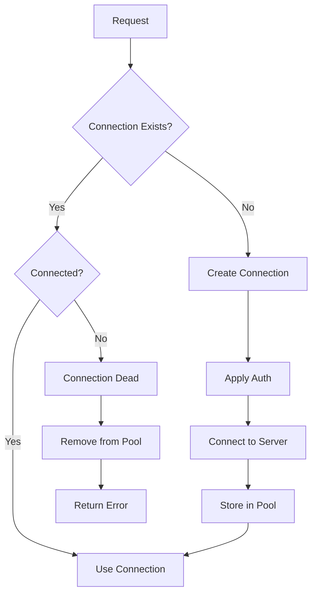
```mermaid
graph TD
    A[Request] --> B{Connection Exists?}
    B -->|Yes| C{Connected?}
    B -->|No| D[Create Connection]
    C -->|Yes| E[Use Connection]
    C -->|No| F[Connection Dead]
    D --> G[Apply Auth]
    G --> H[Connect to Server]
    H --> I[Store in Pool]
    I --> E
    F --> J[Remove from Pool]
    J --> K[Return Error]
```

**Connection Key Format**:
```
${clientId}:${serverId}:${credentialHash}

Where credentialHash is:
- "gateway" for gateway-level auth
- SHA-256(JSON.stringify(credentials)) for client auth
```

**Pool Configuration**:
```typescript
{
  maxConnectionsPerServer: number    // Default: 10
  maxConnectionsPerClient: number    // Default: 5
  evictionStrategy: 'lru'            // Least Recently Used
  idleTimeoutMs: number              // Default: 300000 (5 min)
}
```

**Pool Limits**:
- **Per-Server Limit**: Maximum connections to single server across all clients
- **Per-Client Limit**: Maximum connections single client can have across all servers
- When limit reached: Evict LRU connection and close

**LRU Eviction Algorithm**:
1. Track `lastUsed` timestamp for each connection
2. When pool full and new connection needed:
    - Find oldest `lastUsed` connection
    - Send graceful close to MCP server
    - Remove from pool
    - Insert new connection

**Connection Lifecycle**:

| State | Description | Transitions |
|-------|-------------|-------------|
| Creating | Connection in progress | → Active or Failed |
| Active | Connected and usable | → Idle or Closed |
| Idle | Connected but unused | → Active or Evicted |
| Closed | Gracefully disconnected | (terminal) |
| Failed | Connection error | (terminal) |

---

## 6. Client Session Management

### 6.1 Client Connection Flow

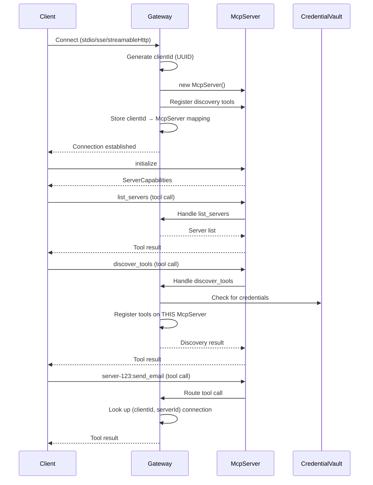
```mermaid
sequenceDiagram
    participant Client
    participant Gateway
    participant McpServer
    participant CredentialVault
    
    Client->>Gateway: Connect (stdio/sse/streamableHttp)
    Gateway->>Gateway: Generate clientId (UUID)
    Gateway->>McpServer: new McpServer()
    Gateway->>McpServer: Register discovery tools
    Gateway->>Gateway: Store clientId → McpServer mapping
    Gateway-->>Client: Connection established
    
    Client->>McpServer: initialize
    McpServer-->>Client: ServerCapabilities
    
    Client->>McpServer: list_servers (tool call)
    McpServer->>Gateway: Handle list_servers
    Gateway-->>McpServer: Server list
    McpServer-->>Client: Tool result
    
    Client->>McpServer: discover_tools (tool call)
    McpServer->>Gateway: Handle discover_tools
    Gateway->>CredentialVault: Check for credentials
    Gateway->>Gateway: Register tools on THIS McpServer
    Gateway-->>McpServer: Discovery result
    McpServer-->>Client: Tool result
    
    Client->>McpServer: server-123:send_email (tool call)
    McpServer->>Gateway: Route tool call
    Gateway->>Gateway: Look up (clientId, serverId) connection
    Gateway-->>Client: Tool result
```

### 6.2 Per-Client McpServer Instance

**Key Principle**: Each client gets isolated McpServer instance

**Instance Configuration**:
```typescript
{
  name: "mcp-gateway"
  version: "1.0.0"
  capabilities: {
    tools: {}  // Dynamic tool registration
    resources: {}  // Dynamic resource registration  
    prompts: {}  // Dynamic prompt registration
  }
}
```

**Discovery Tools** (registered on all clients):
- `list_servers`
- `discover_tools`
- `discover_resources`
- `discover_prompts`
- `search_tools`
- `search_resources`
- `search_prompts`
- `initiate_oauth`
- `check_auth_status`

**Dynamic Registration** (per-client):
- Discovered tools: `${prefix}:${toolName}`
- Discovered resources: `${prefix}:${resourceUri}`
- Discovered prompts: `${prefix}:${promptName}`

**Registration Tracking**:
```typescript
{
  clientId: string
  registrations: {
    tools: Map<registeredName, {
      serverId: string
      originalName: string
      connectionKey: string
    }>
    resources: Map<registeredName, {
      serverId: string
      originalUri: string
      connectionKey: string
    }>
    prompts: Map<registeredName, {
      serverId: string
      originalName: string
      connectionKey: string
    }>
  }
}
```

### 6.3 Discovery Tool Specifications

**Tool: list_servers**

Purpose: List all connected MCP servers

Input Schema:
```json
{
  "type": "object",
  "properties": {},
  "additionalProperties": false
}
```

Output Schema:
```json
{
  "servers": [
    {
      "id": "string",
      "name": "string",
      "description": "string",
      "capabilities": {},
      "authStrategy": "gateway | client | optional",
      "authRequired": "boolean",
      "authTypes": ["api_key", "bearer", "basic", "oauth"],
      "counts": {
        "tools": "number",
        "resources": "number",
        "prompts": "number"
      },
      "status": "ready | connecting | error"
    }
  ]
}
```

**Tool: discover_tools**

Purpose: Discover and register tools from server

Input Schema:
```json
{
  "type": "object",
  "properties": {
    "serverId": {
      "type": "string",
      "description": "Server ID to discover tools from"
    },
    "aliasPrefix": {
      "type": "string",
      "description": "Prefix for tool names (default: serverId)"
    },
    "credentials": {
      "type": "object",
      "description": "Authentication credentials (if required)",
      "properties": {
        "type": {
          "type": "string",
          "enum": ["api_key", "bearer", "basic"]
        },
        "apiKey": { "type": "string" },
        "token": { "type": "string" },
        "username": { "type": "string" },
        "password": { "type": "string" }
      }
    }
  },
  "required": ["serverId"]
}
```

Output Schema:
```json
{
  "serverId": "string",
  "toolsRegistered": ["array", "of", "tool", "names"],
  "count": "number"
}
```

Error Codes:
- `SERVER_NOT_FOUND`: serverId doesn't exist
- `AUTHENTICATION_REQUIRED`: server requires credentials but none provided
- `AUTHENTICATION_FAILED`: provided credentials rejected
- `SERVER_UNAVAILABLE`: server connection failed
- `ALREADY_DISCOVERED`: tools from this server already registered with this prefix

**Tool: search_tools**

Purpose: Search for tools using natural language

Input Schema:
```json
{
  "type": "object",
  "properties": {
    "query": {
      "type": "string",
      "description": "Natural language search query"
    },
    "limit": {
      "type": "number",
      "default": 10,
      "maximum": 50,
      "description": "Maximum results to return"
    },
    "minSimilarity": {
      "type": "number",
      "default": 0.3,
      "minimum": 0.0,
      "maximum": 1.0,
      "description": "Minimum similarity score threshold"
    },
    "serverIds": {
      "type": "array",
      "items": { "type": "string" },
      "description": "Filter to specific servers"
    },
    "autoDiscover": {
      "type": "boolean",
      "default": true,
      "description": "Automatically discover top result"
    }
  },
  "required": ["query"]
}
```

Output Schema:
```json
{
  "results": [
    {
      "serverId": "string",
      "serverName": "string",
      "toolName": "string",
      "description": "string",
      "similarity": "number",
      "requiresAuth": "boolean",
      "authStrategy": "gateway | client | optional",
      "discovered": "boolean"
    }
  ],
  "query": "string",
  "resultCount": "number",
  "autoDiscovered": {
    "serverId": "string",
    "toolsRegistered": ["array"],
    "count": "number"
  }
}
```

Behavior:
- If `autoDiscover: true` (default) and results found:
    - Automatically call `discover_tools` for server of top result
    - Include discovery result in response
    - Client can immediately use discovered tools
- If `autoDiscover: false`:
    - Return search results only
    - Client must explicitly call `discover_tools`

**Tool: initiate_oauth**

Purpose: Start OAuth 2.0 authorization flow

Input Schema:
```json
{
  "type": "object",
  "properties": {
    "serverId": {
      "type": "string",
      "description": "Server ID requiring OAuth"
    }
  },
  "required": ["serverId"]
}
```

Output Schema:
```json
{
  "authorizationUrl": "string",
  "state": "string",
  "expiresAt": "number"
}
```

Error Codes:
- `SERVER_NOT_OAUTH`: Server doesn't use OAuth
- `OAUTH_NOT_CONFIGURED`: OAuth config missing
- `SERVER_NOT_FOUND`: serverId doesn't exist

Client Flow:
1. Call `initiate_oauth(serverId)`
2. Receive `authorizationUrl`
3. Open URL in browser (user authorizes)
4. Gateway receives callback
5. Gateway stores tokens automatically
6. Client can now call `discover_tools(serverId)` without credentials

### 6.4 Tool Invocation Flow

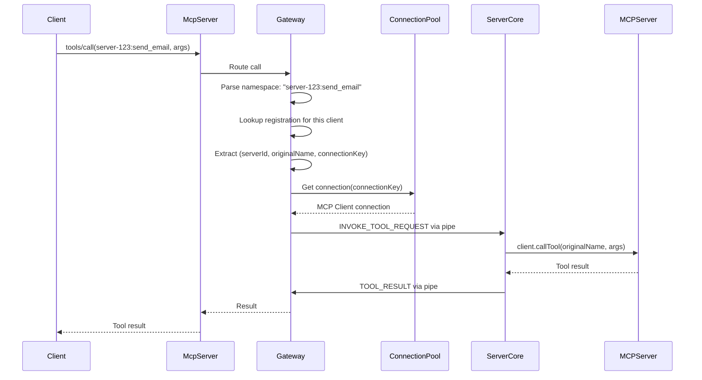
```mermaid
sequenceDiagram
    participant Client
    participant McpServer
    participant Gateway
    participant ConnectionPool
    participant ServerCore
    participant MCPServer
    
    Client->>McpServer: tools/call(server-123:send_email, args)
    McpServer->>Gateway: Route call
    Gateway->>Gateway: Parse namespace: "server-123:send_email"
    Gateway->>Gateway: Lookup registration for this client
    Gateway->>Gateway: Extract (serverId, originalName, connectionKey)
    Gateway->>ConnectionPool: Get connection(connectionKey)
    ConnectionPool-->>Gateway: MCP Client connection
    Gateway->>ServerCore: INVOKE_TOOL_REQUEST via pipe
    ServerCore->>MCPServer: client.callTool(originalName, args)
    MCPServer-->>ServerCore: Tool result
    ServerCore->>Gateway: TOOL_RESULT via pipe
    Gateway-->>McpServer: Result
    McpServer-->>Client: Tool result
```

**Namespace Resolution**:
1. Extract prefix and name: `"server-123:send_email"` → `["server-123", "send_email"]`
2. Look up in client's registration map
3. Get `{ serverId, originalName, connectionKey }`
4. Route to Server Core for that serverId
5. Include connectionKey for auth

**Error Handling**:
- Tool not registered → `METHOD_NOT_FOUND` (-32601)
- Server disconnected → `SERVER_UNAVAILABLE` (custom)
- Authentication failed → `AUTHENTICATION_FAILED` (custom)
- Timeout (30s) → `REQUEST_TIMEOUT` (custom)

### 6.5 Resource Reading Flow

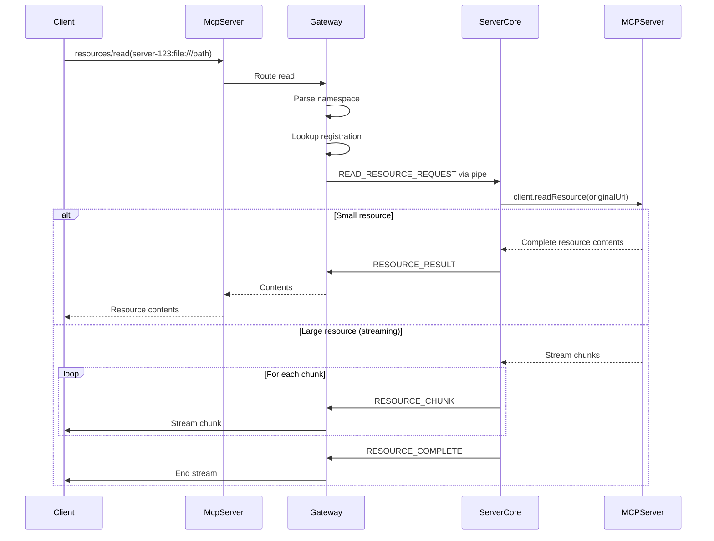
```mermaid
sequenceDiagram
    participant Client
    participant McpServer
    participant Gateway
    participant ServerCore
    participant MCPServer
    
    Client->>McpServer: resources/read(server-123:file:///path)
    McpServer->>Gateway: Route read
    Gateway->>Gateway: Parse namespace
    Gateway->>Gateway: Lookup registration
    Gateway->>ServerCore: READ_RESOURCE_REQUEST via pipe
    ServerCore->>MCPServer: client.readResource(originalUri)
    
    alt Small resource
        MCPServer-->>ServerCore: Complete resource contents
        ServerCore->>Gateway: RESOURCE_RESULT
        Gateway-->>McpServer: Contents
        McpServer-->>Client: Resource contents
    else Large resource (streaming)
        MCPServer-->>ServerCore: Stream chunks
        loop For each chunk
            ServerCore->>Gateway: RESOURCE_CHUNK
            Gateway->>Client: Stream chunk
        end
        ServerCore->>Gateway: RESOURCE_COMPLETE
        Gateway->>Client: End stream
    end
```

**Streaming Strategy**:
- Resources < 1MB: Return complete in single response
- Resources ≥ 1MB: Stream in chunks
- Chunk size: 64KB
- Use Server-Sent Events for streaming over HTTP
- Use stdout for streaming over stdio

**Resource Registration**:
- Registered name: `${prefix}:${resourceUri}`
- Example: `"github:repo://owner/repo/file.txt"`
- Original URI stored in registration map
- Client uses registered name, gateway translates to original URI

### 6.6 Prompt Invocation Flow

Prompts work similarly to tools, with dynamic argument schema resolution:

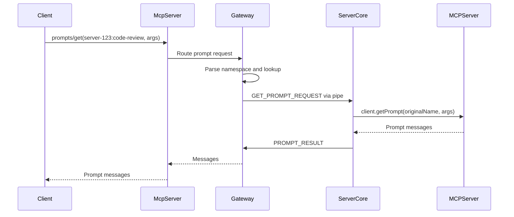
```mermaid
sequenceDiagram
    participant Client
    participant McpServer
    participant Gateway
    participant ServerCore
    participant MCPServer
    
    Client->>McpServer: prompts/get(server-123:code-review, args)
    McpServer->>Gateway: Route prompt request
    Gateway->>Gateway: Parse namespace and lookup
    Gateway->>ServerCore: GET_PROMPT_REQUEST via pipe
    ServerCore->>MCPServer: client.getPrompt(originalName, args)
    MCPServer-->>ServerCore: Prompt messages
    ServerCore->>Gateway: PROMPT_RESULT
    Gateway-->>McpServer: Messages
    McpServer-->>Client: Prompt messages
```

**Argument Schema Handling**:
- Prompt schemas can be dynamic (generated based on server state)
- Always re-fetch prompt from server on each invocation
- Do not cache prompt schemas
- Server determines required/optional arguments at call time

**Why Re-Fetch?**:
- Prompt arguments may depend on server state
- Schema may change based on available data
- Example: File path arguments depend on current filesystem state
- Ensures arguments are always valid for current server context

---

## 7. Message Routing

### 7.1 Pipe Message Protocol

All inter-core messages follow this envelope format:

```typescript
{
  messageType: string           // Message type identifier
  messageId: string            // UUID for request tracking
  timestamp: number            // Unix timestamp in milliseconds
  sourceCore: string           // Core ID that sent message
  destinationCore: string      // Core ID that should receive message
  payload: any                 // Message-specific data
  correlationId?: string       // For request-response correlation
}
```

### 7.2 Message Type Specifications

**INITIALIZE_SERVER** (Gateway → Server Core)

Sent during startup to configure a Server Core

```typescript
{
  messageType: 'INITIALIZE_SERVER'
  payload: {
    serverId: string
    config: ServerConfig
  }
}
```

**SERVER_READY** (Server Core → Gateway)

Indicates server successfully connected and cached

```typescript
{
  messageType: 'SERVER_READY'
  payload: {
    serverId: string
    capabilities: ServerCapabilities
    protocolVersion: string
    serverInfo?: ServerInfo
  }
}
```

**CACHE_UPDATE** (Server Core → Gateway)

Sends updated capabilities for indexing

```typescript
{
  messageType: 'CACHE_UPDATE'
  payload: {
    serverId: string
    tools?: Tool[]
    resources?: Resource[]
    prompts?: Prompt[]
    capabilities?: ServerCapabilities
    updateType: 'initial' | 'list_changed'
  }
}
```

**INVOKE_TOOL_REQUEST** (Gateway → Server Core)

Requests tool execution

```typescript
{
  messageType: 'INVOKE_TOOL_REQUEST'
  correlationId: string  // For matching response
  payload: {
    serverId: string
    connectionKey: string
    toolName: string
    arguments: any
    clientId: string
  }
}
```

**TOOL_RESULT** (Server Core → Gateway)

Returns tool execution result

```typescript
{
  messageType: 'TOOL_RESULT'
  correlationId: string  // Matches request
  payload: {
    success: boolean
    content?: Array<TextContent | ImageContent | EmbeddedResource>
    isError?: boolean
    error?: {
      code: number
      message: string
      data?: any
    }
  }
}
```

**READ_RESOURCE_REQUEST** (Gateway → Server Core)

```typescript
{
  messageType: 'READ_RESOURCE_REQUEST'
  correlationId: string
  payload: {
    serverId: string
    connectionKey: string
    uri: string
    clientId: string
  }
}
```

**RESOURCE_RESULT** (Server Core → Gateway)

For complete resources (< 1MB):

```typescript
{
  messageType: 'RESOURCE_RESULT'
  correlationId: string
  payload: {
    success: boolean
    contents?: ResourceContents[]
    error?: ErrorInfo
  }
}
```

**RESOURCE_CHUNK** (Server Core → Gateway)

For streaming large resources:

```typescript
{
  messageType: 'RESOURCE_CHUNK'
  correlationId: string
  payload: {
    data: string | Buffer
    encoding: 'utf-8' | 'base64'
    chunkIndex: number
    totalChunks?: number  // If known
  }
}
```

**RESOURCE_COMPLETE** (Server Core → Gateway)

Signals end of resource stream:

```typescript
{
  messageType: 'RESOURCE_COMPLETE'
  correlationId: string
  payload: {
    success: boolean
    totalBytes: number
    mimeType: string
    error?: ErrorInfo
  }
}
```

**GET_PROMPT_REQUEST** (Gateway → Server Core)

```typescript
{
  messageType: 'GET_PROMPT_REQUEST'
  correlationId: string
  payload: {
    serverId: string
    connectionKey: string
    promptName: string
    arguments?: Record<string, string>
    clientId: string
  }
}
```

**PROMPT_RESULT** (Server Core → Gateway)

```typescript
{
  messageType: 'PROMPT_RESULT'
  correlationId: string
  payload: {
    success: boolean
    description?: string
    messages?: PromptMessage[]
    error?: ErrorInfo
  }
}
```

**SERVER_ERROR** (Server Core → Gateway)

Indicates server connection error or failure:

```typescript
{
  messageType: 'SERVER_ERROR'
  payload: {
    serverId: string
    error: {
      code: string
      message: string
      fatal: boolean
      timestamp: number
    }
  }
}
```

**LIST_CHANGED** (Server Core → Gateway)

Notification that server list changed:

```typescript
{
  messageType: 'LIST_CHANGED'
  payload: {
    serverId: string
    listType: 'tools' | 'resources' | 'prompts'
  }
}
```

### 7.3 Request-Response Correlation

**Pattern**:
1. Requester generates UUID as `correlationId`
2. Requester stores Promise resolver in map: `correlationId → { resolve, reject }`
3. Requester sends message with `correlationId`
4. Requester sets 30-second timeout
5. Responder includes same `correlationId` in response
6. Requester matches response, resolves Promise
7. If timeout: reject Promise, cleanup correlation map

**Timeout Handling**:
```typescript
{
  messageType: 'REQUEST_TIMEOUT'
  correlationId: string
  payload: {
    originalMessageType: string
    timeoutMs: number
  }
}
```

### 7.4 Message Flow Diagrams

**Tool Invocation Complete Flow**:

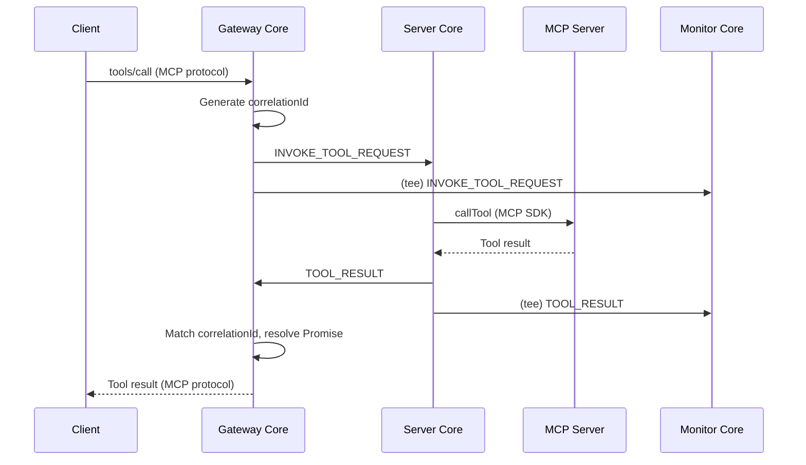
```mermaid
sequenceDiagram
    participant C as Client
    participant GW as Gateway Core
    participant SC as Server Core
    participant MS as MCP Server
    participant MC as Monitor Core
    
    C->>GW: tools/call (MCP protocol)
    GW->>GW: Generate correlationId
    GW->>SC: INVOKE_TOOL_REQUEST
    GW->>MC: (tee) INVOKE_TOOL_REQUEST
    SC->>MS: callTool (MCP SDK)
    MS-->>SC: Tool result
    SC->>GW: TOOL_RESULT
    SC->>MC: (tee) TOOL_RESULT
    GW->>GW: Match correlationId, resolve Promise
    GW-->>C: Tool result (MCP protocol)
```

**List Changed Flow**:

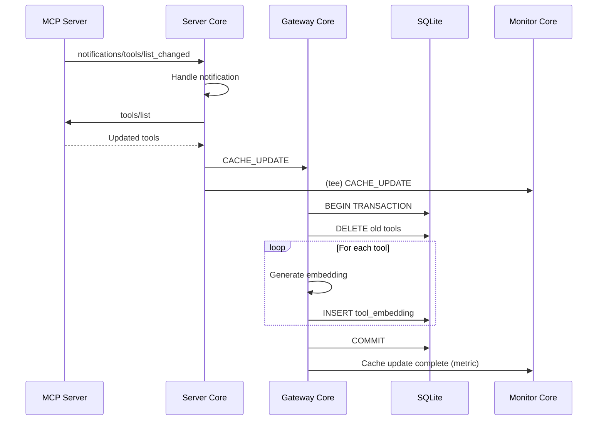
```mermaid
sequenceDiagram
    participant MS as MCP Server
    participant SC as Server Core
    participant GW as Gateway Core
    participant SQL as SQLite
    participant MC as Monitor Core
    
    MS->>SC: notifications/tools/list_changed
    SC->>SC: Handle notification
    SC->>MS: tools/list
    MS-->>SC: Updated tools
    SC->>GW: CACHE_UPDATE
    SC->>MC: (tee) CACHE_UPDATE
    GW->>SQL: BEGIN TRANSACTION
    GW->>SQL: DELETE old tools
    loop For each tool
        GW->>GW: Generate embedding
        GW->>SQL: INSERT tool_embedding
    end
    GW->>SQL: COMMIT
    GW->>MC: Cache update complete (metric)
```

**OAuth Flow with Messages**:

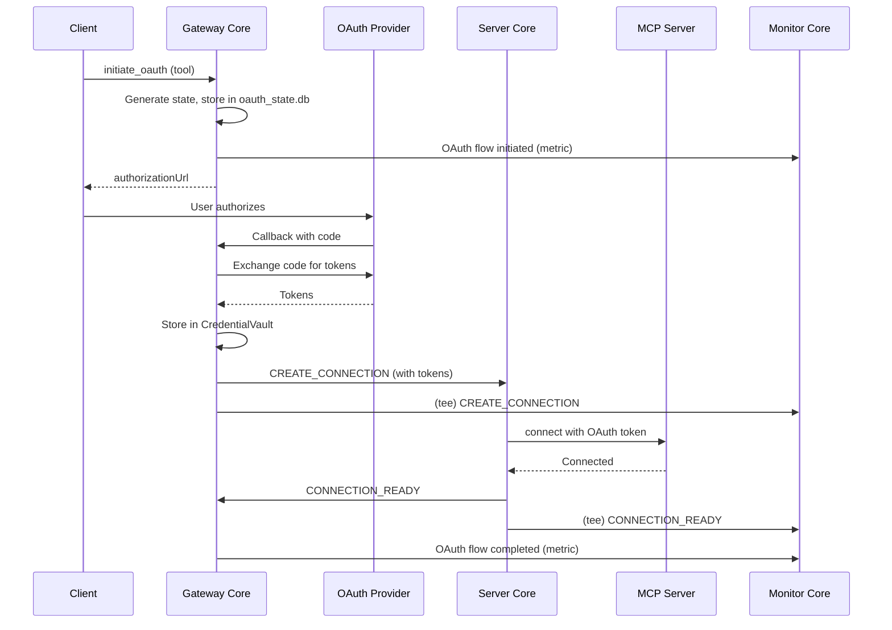
```mermaid
sequenceDiagram
    participant C as Client
    participant GW as Gateway Core
    participant OP as OAuth Provider
    participant SC as Server Core
    participant MS as MCP Server
    participant MC as Monitor Core
    
    C->>GW: initiate_oauth (tool)
    GW->>GW: Generate state, store in oauth_state.db
    GW->>MC: OAuth flow initiated (metric)
    GW-->>C: authorizationUrl
    C->>OP: User authorizes
    OP->>GW: Callback with code
    GW->>OP: Exchange code for tokens
    OP-->>GW: Tokens
    GW->>GW: Store in CredentialVault
    GW->>SC: CREATE_CONNECTION (with tokens)
    GW->>MC: (tee) CREATE_CONNECTION
    SC->>MS: connect with OAuth token
    MS-->>SC: Connected
    SC->>GW: CONNECTION_READY
    SC->>MC: (tee) CONNECTION_READY
    GW->>MC: OAuth flow completed (metric)
```

---

## 8. Monitoring & Observability

### 8.1 Monitoring Core Architecture

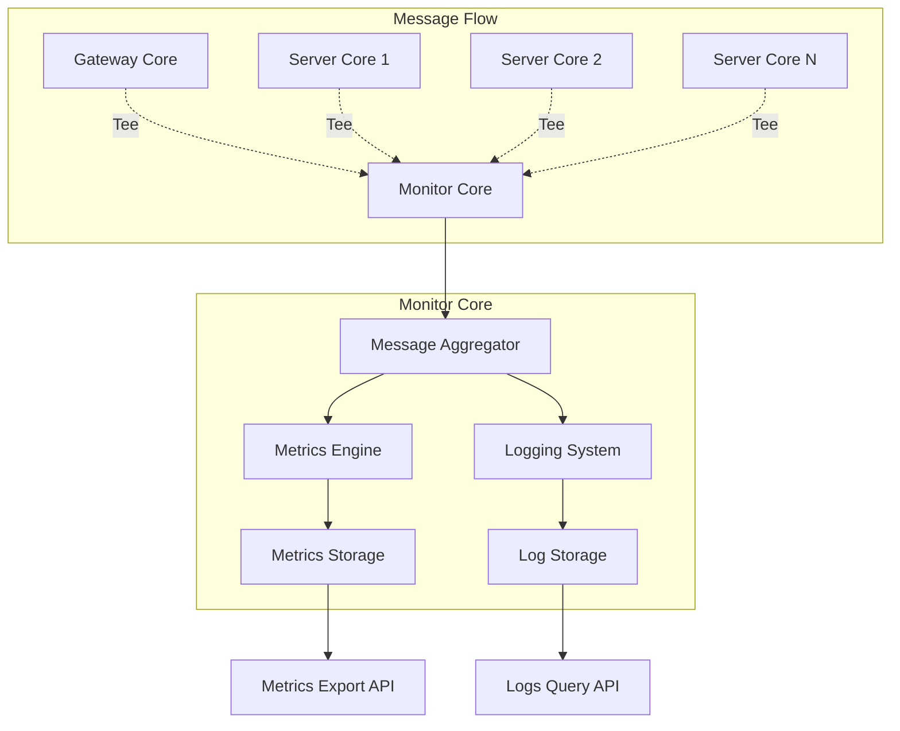
```mermaid
graph TB
    subgraph "Message Flow"
        GW[Gateway Core] -.Tee.-> MON[Monitor Core]
        SC1[Server Core 1] -.Tee.-> MON
        SC2[Server Core 2] -.Tee.-> MON
        SCN[Server Core N] -.Tee.-> MON
    end
    
    subgraph "Monitor Core"
        MON --> AGG[Message Aggregator]
        AGG --> MET[Metrics Engine]
        AGG --> LOG[Logging System]
        MET --> STORE[Metrics Storage]
        LOG --> STORE2[Log Storage]
    end
    
    STORE --> EXP[Metrics Export API]
    STORE2 --> EXP2[Logs Query API]
```

**Purpose**:
- Observe all inter-core communication
- Track system performance metrics
- Provide debugging and troubleshooting data
- Enable operational monitoring

**Key Principle**: Non-invasive observation
- Teed pipes copy messages without affecting delivery
- Monitor Core failure doesn't impact gateway operation
- No request/response to Monitor Core from other cores

### 8.2 Monitored Metrics

**Connection Metrics**:
- Total servers configured
- Servers in ready state
- Servers in error state
- Total client connections
- Active client connections
- Connection pool utilization per server
- Connection creation rate
- Connection close rate

**Request Metrics**:
- Tool invocations per server
- Tool invocation latency (p50, p95, p99)
- Tool success rate
- Tool error rate by error type
- Resource reads per server
- Resource read bytes
- Prompt requests per server
- Cache hit/miss rate

**Discovery Metrics**:
- Discovery operations per client
- Search queries executed
- Auto-discovery trigger rate
- Tools registered per client (histogram)
- Resources registered per client
- Prompts registered per client

**Authentication Metrics**:
- OAuth flows initiated
- OAuth flows completed
- OAuth flows failed
- Token refresh operations
- Authentication failures by type
- Credentials stored in vault

**Cache Metrics**:
- Cache update operations
- Embeddings generated
- Embedding generation time
- Vector search queries
- Vector search latency
- Database size

**Error Metrics**:
- Errors by message type
- Errors by server
- Timeout occurrences
- Connection failures
- Authentication errors

### 8.3 Logging

**Log Levels**:
- DEBUG: Detailed message contents
- INFO: Lifecycle events, discoveries, connections
- WARN: Recoverable errors, retries
- ERROR: Failures, exceptions
- FATAL: System-critical failures

**Log Structure**:
```typescript
{
  timestamp: number
  level: 'DEBUG' | 'INFO' | 'WARN' | 'ERROR' | 'FATAL'
  coreId: string
  messageType?: string
  messageId?: string
  correlationId?: string
  serverId?: string
  clientId?: string
  message: string
  context?: Record<string, any>
  error?: {
    name: string
    message: string
    stack?: string
  }
}
```

**Logged Events**:

| Event | Level | Context |
|-------|-------|---------|
| Gateway startup | INFO | config summary |
| Server core created | INFO | serverId, config |
| Server connection established | INFO | serverId, capabilities |
| Server connection failed | ERROR | serverId, error details |
| Client connected | INFO | clientId, transport |
| Client disconnected | INFO | clientId, duration |
| Discovery operation | INFO | clientId, serverId, items count |
| Tool invocation | DEBUG | clientId, serverId, tool name |
| Tool error | WARN | clientId, serverId, error |
| Cache update | INFO | serverId, items updated |
| OAuth flow started | INFO | clientId, serverId |
| OAuth flow completed | INFO | clientId, serverId |
| Authentication failure | WARN | clientId, serverId, auth type |
| Message timeout | WARN | messageType, correlationId |
| Pipe message | DEBUG | full message |

### 8.4 Metrics Export

**Implementation**: TBD

**Suggested Approaches**:
- Prometheus endpoint: `/metrics`
- StatsD protocol: UDP metrics push
- JSON endpoint: `/api/metrics`
- File-based: Write metrics to JSON file periodically

**Metric Format** (Prometheus example):
```
# Tool invocations
gateway_tool_invocations_total{server_id="github",status="success"} 145
gateway_tool_invocations_total{server_id="github",status="error"} 3

# Latency histogram
gateway_tool_latency_seconds_bucket{server_id="github",le="0.1"} 120
gateway_tool_latency_seconds_bucket{server_id="github",le="0.5"} 140
gateway_tool_latency_seconds_bucket{server_id="github",le="1.0"} 145

# Connection pool
gateway_connection_pool_size{server_id="github"} 3
gateway_connection_pool_capacity{server_id="github"} 10

# Cache
gateway_cache_embeddings_total 1247
gateway_cache_search_queries_total 89
```

### 8.5 Distributed Tracing

**Trace Context**:
- Each request generates trace ID
- Trace ID propagated through correlationId
- Spans created for each operation:
    - Client request received
    - Tool invocation requested
    - Server Core processing
    - MCP server call
    - Response returned

**Trace Example**:
```
Trace ID: 550e8400-e29b-41d4-a716-446655440000

Span 1: Client Request
  Start: 2025-12-20T10:00:00.000Z
  Duration: 250ms
  Attributes:
    client_id: "client-abc"
    tool_name: "github:create-issue"

  Span 2: Gateway Routing
    Start: 2025-12-20T10:00:00.010Z
    Duration: 5ms
    Attributes:
      server_id: "github"
      connection_key: "client-abc:github:hash123"

  Span 3: Server Core Processing
    Start: 2025-12-20T10:00:00.015Z
    Duration: 235ms
    Attributes:
      server_id: "github"
      original_tool: "create-issue"

    Span 4: MCP Client Call
      Start: 2025-12-20T10:00:00.020Z
      Duration: 230ms
      Attributes:
        method: "tools/call"
        tool: "create-issue"
```

---

## 9. Configuration

### 9.1 Configuration File Schema

**File Format**: JSON or YAML

**Complete Schema**:

```typescript
{
  gateway: {
    // Gateway identity
    name: string                    // Human-readable name
    version: string                 // Semantic version
    description?: string            // Optional description
    
    // Network configuration
    listen: {
      type: 'stdio' | 'sse' | 'streamableHttp'
      
      // For sse or streamableHttp
      host?: string                 // Default: "localhost"
      port?: number                 // Default: 3000
      path?: string                 // URL path, default: "/"
      
      // TLS configuration (for sse/streamableHttp)
      tls?: {
        enabled: boolean
        certFile: string
        keyFile: string
        caFile?: string
      }
    }
    
    // Security
    encryption: {
      masterKey: string             // 64 hex characters (256-bit)
    }
    
    // OAuth configuration
    oauth?: {
      callbackUrl: string           // Full URL for OAuth redirects
      callbackPath?: string         // Path portion, default: "/oauth/callback"
      stateExpiration: number       // Minutes, default: 10
    }
    
    // Database paths
    databases: {
      cache: string                 // Path to cache.db
      credentials: string           // Path to credentials.db
      oauthState: string           // Path to oauth_state.db
    }
    
    // Connection pooling
    connectionPool: {
      maxConnectionsPerServer: number    // Default: 10
      maxConnectionsPerClient: number    // Default: 5
      idleTimeoutMs: number             // Default: 300000 (5 min)
      evictionStrategy: 'lru'           // Only LRU supported
    }
    
    // Performance tuning
    performance: {
      maxConcurrentRequests: number     // Per client, default: 10
      requestTimeoutMs: number          // Default: 30000
      embeddingBatchSize: number        // Default: 100
    }
    
    // Monitoring
    monitoring?: {
      enabled: boolean                  // Default: true
      metricsExport?: {
        type: 'prometheus' | 'statsd' | 'json'
        endpoint?: string
        port?: number
        interval?: number               // Seconds
      }
      logging: {
        level: 'DEBUG' | 'INFO' | 'WARN' | 'ERROR' | 'FATAL'
        output: 'stdout' | 'file'
        file?: string
        maxSizeBytes?: number
        maxFiles?: number
      }
    }
  }
  
  servers: ServerConfig[]
}
```

**ServerConfig Schema**:

```typescript
{
  // Identity
  id: string                        // Unique identifier
  name: string                      // Human-readable name
  description?: string              // Optional description
  
  // Authentication strategy
  authStrategy: 'gateway' | 'client' | 'optional'
  
  // Gateway-level authentication
  gatewayAuth?: {
    type: 'none' | 'api_key' | 'bearer' | 'basic' | 'oauth'
    
    // API Key
    apiKey?: string
    apiKeyHeader?: string           // Default: "Authorization"
    apiKeyPrefix?: string           // Default: "Bearer"
    
    // Bearer token
    token?: string
    
    // Basic auth
    username?: string
    password?: string
    
    // OAuth (service account)
    oauth?: OAuthConfig
  }
  
  // OAuth configuration (for client auth)
  oauth?: OAuthConfig
  
  // Transport configuration
  transport: {
    type: 'stdio' | 'sse' | 'streamableHttp'
    
    // For stdio
    command?: string
    args?: string[]
    env?: Record<string, string>
    cwd?: string
    
    // For sse
    url?: string
    headers?: Record<string, string>
    
    // For streamableHttp
    url?: string
    headers?: Record<string, string>
  }
  
  // Connection behavior
  retryConfig?: {
    maxRetries: number              // Default: 0 (no retries)
    retryDelayMs: number
    backoffMultiplier: number
  }
  
  // Feature flags
  features?: {
    supportsListChanged: boolean    // Override capability detection
  }
}
```

**OAuthConfig Schema**:

```typescript
{
  authorizationUrl: string
  tokenUrl: string
  clientId: string
  clientSecret: string
  scopes: string[]
  redirectUri?: string              // Override default callback URL
  additionalParams?: Record<string, string>
}
```

### 9.2 Example Configurations

**Minimal Configuration**:

```json
{
  "gateway": {
    "name": "My Gateway",
    "version": "1.0.0",
    "listen": {
      "type": "stdio"
    },
    "encryption": {
      "masterKey": "0123456789abcdef0123456789abcdef0123456789abcdef0123456789abcdef"
    },
    "databases": {
      "cache": "./data/cache.db",
      "credentials": "./data/credentials.db",
      "oauthState": "./data/oauth.db"
    }
  },
  "servers": [
    {
      "id": "filesystem",
      "name": "Local Files",
      "authStrategy": "gateway",
      "gatewayAuth": {
        "type": "none"
      },
      "transport": {
        "type": "stdio",
        "command": "mcp-server-filesystem",
        "args": ["/home/user/documents"]
      }
    }
  ]
}
```

**Production Configuration**:

```json
{
  "gateway": {
    "name": "Production Gateway",
    "version": "1.0.0",
    "description": "Multi-server MCP gateway for production",
    "listen": {
      "type": "streamableHttp",
      "host": "0.0.0.0",
      "port": 443,
      "path": "/mcp",
      "tls": {
        "enabled": true,
        "certFile": "/etc/ssl/certs/gateway.crt",
        "keyFile": "/etc/ssl/private/gateway.key"
      }
    },
    "encryption": {
      "masterKey": "${GATEWAY_MASTER_KEY}"
    },
    "oauth": {
      "callbackUrl": "https://gateway.example.com/oauth/callback",
      "stateExpiration": 10
    },
    "databases": {
      "cache": "/var/lib/gateway/cache.db",
      "credentials": "/var/lib/gateway/credentials.db",
      "oauthState": "/var/lib/gateway/oauth.db"
    },
    "connectionPool": {
      "maxConnectionsPerServer": 20,
      "maxConnectionsPerClient": 10,
      "idleTimeoutMs": 600000
    },
    "performance": {
      "maxConcurrentRequests": 50,
      "requestTimeoutMs": 60000,
      "embeddingBatchSize": 200
    },
    "monitoring": {
      "enabled": true,
      "metricsExport": {
        "type": "prometheus",
        "port": 9090,
        "interval": 15
      },
      "logging": {
        "level": "INFO",
        "output": "file",
        "file": "/var/log/gateway/gateway.log",
        "maxSizeBytes": 104857600,
        "maxFiles": 10
      }
    }
  },
  "servers": [
    {
      "id": "internal-filesystem",
      "name": "Internal Filesystem",
      "description": "Company shared file server",
      "authStrategy": "gateway",
      "gatewayAuth": {
        "type": "basic",
        "username": "gateway_service",
        "password": "${FILESYSTEM_PASSWORD}"
      },
      "transport": {
        "type": "streamableHttp",
        "url": "https://fileserver.internal/mcp",
        "headers": {
          "X-Gateway-ID": "prod-gateway-01"
        }
      }
    },
    {
      "id": "github",
      "name": "GitHub",
      "description": "GitHub API access",
      "authStrategy": "client",
      "transport": {
        "type": "stdio",
        "command": "npx",
        "args": ["-y", "@modelcontextprotocol/server-github"]
      }
    },
    {
      "id": "google-drive",
      "name": "Google Drive",
      "description": "Google Drive access via OAuth",
      "authStrategy": "client",
      "oauth": {
        "authorizationUrl": "https://accounts.google.com/o/oauth2/v2/auth",
        "tokenUrl": "https://oauth2.googleapis.com/token",
        "clientId": "${GOOGLE_CLIENT_ID}",
        "clientSecret": "${GOOGLE_CLIENT_SECRET}",
        "scopes": [
          "https://www.googleapis.com/auth/drive.readonly"
        ]
      },
      "transport": {
        "type": "stdio",
        "command": "npx",
        "args": ["-y", "@modelcontextprotocol/server-gdrive"]
      }
    },
    {
      "id": "shared-database",
      "name": "Shared Database",
      "description": "Company PostgreSQL with optional user override",
      "authStrategy": "optional",
      "gatewayAuth": {
        "type": "basic",
        "username": "readonly_user",
        "password": "${DB_READONLY_PASSWORD}"
      },
      "transport": {
        "type": "stdio",
        "command": "mcp-server-postgres",
        "env": {
          "POSTGRES_HOST": "db.internal",
          "POSTGRES_PORT": "5432",
          "POSTGRES_DB": "company_data"
        }
      }
    }
  ]
}
```

### 9.3 Configuration Validation

**Required Fields**:
- `gateway.name`
- `gateway.version`
- `gateway.listen.type`
- `gateway.encryption.masterKey` (must be 64 hex characters)
- `gateway.databases.cache`
- `gateway.databases.credentials`
- `gateway.databases.oauthState`
- Each server must have: `id`, `name`, `authStrategy`, `transport.type`

**Validation Rules**:
- Server IDs must be unique
- Server IDs must match pattern: `^[a-z0-9-]+$`
- Master key must be exactly 64 hex characters
- If `authStrategy` is "gateway", `gatewayAuth` must be present
- If `authStrategy` is "client" and OAuth, `oauth` must be configured
- Transport type must have corresponding transport fields
- Port numbers must be 1-65535
- Timeouts must be positive integers
- Pool limits must be > 0

**Environment Variable Substitution**:
- Pattern: `${VARIABLE_NAME}`
- Substituted at startup
- Missing variables cause startup failure
- Used for sensitive data (passwords, tokens, keys)

---

## 10. Error Handling

### 10.1 Error Categories

**Connection Errors**:
- Server unreachable
- Authentication failed
- Protocol version mismatch
- Transport error

**Request Errors**:
- Tool not found
- Invalid arguments
- Timeout
- Server error response

**System Errors**:
- Database error
- Out of memory
- Disk full
- Configuration error

### 10.2 Error Response Format

All errors returned to clients follow MCP JSON-RPC error format:

```json
{
  "code": -32000,
  "message": "Error description",
  "data": {
    "type": "error_type",
    "serverId": "server-123",
    "details": "Additional context"
  }
}
```

**Standard Error Codes**:

| Code | Name | Description |
|------|------|-------------|
| -32700 | Parse error | Invalid JSON |
| -32600 | Invalid Request | Request doesn't conform to protocol |
| -32601 | Method not found | Tool/resource/prompt not registered |
| -32602 | Invalid params | Invalid tool arguments |
| -32603 | Internal error | Gateway internal error |
| -32000 | Server error | MCP server returned error |
| -32001 | Authentication required | Client must provide credentials |
| -32002 | Authentication failed | Invalid credentials |
| -32003 | Server unavailable | Server connection failed |
| -32004 | Request timeout | Request exceeded timeout |
| -32005 | Rate limited | Too many requests |

### 10.3 Error Handling Strategies

**Server Connection Failure**:
1. Mark server as "error" state in registry
2. Log error with full context
3. Do NOT attempt automatic reconnection
4. Return `SERVER_UNAVAILABLE` error to clients
5. Require manual intervention (restart or reconfig)

**Authentication Failure**:
1. Return `AUTHENTICATION_FAILED` error to client
2. Do NOT retry with same credentials
3. For OAuth: Suggest `initiate_oauth` to reauthorize
4. For other auth: Client must provide new credentials

**Request Timeout**:
1. After 30 seconds (configurable), cancel request
2. Send timeout notification to Server Core
3. Return `REQUEST_TIMEOUT` error to client
4. Clean up pending correlation entry
5. Connection remains open (server may still respond)

**Tool Invocation Error**:
1. Propagate MCP error from server directly to client
2. Do not modify error code or message
3. Log error for monitoring
4. Do not retry (client decides retry logic)

**Resource Streaming Error**:
1. If error during stream, send error chunk
2. Close stream immediately
3. Client receives partial data with error indicator
4. Do not retry automatically

**Database Errors**:
1. Cache database error: Log error, continue without cache
2. Credentials database error: FATAL, cannot operate
3. OAuth database error: OAuth flows fail, other operations continue

### 10.4 Error Recovery

**Recoverable Errors** (system continues):
- Individual tool invocation failure
- Resource read failure
- Prompt get failure
- Search query failure
- Cache update failure

**Non-Recoverable Errors** (require restart):
- Credentials database corruption
- Master key invalid
- Configuration file invalid
- Gateway Core initialization failure

**Partial Degradation** (some features unavailable):
- Cache database unavailable: Vector search disabled
- OAuth database unavailable: OAuth flows disabled
- Monitoring Core failure: Observability lost

---

## 11. Performance Considerations

### 11.1 Scalability Targets

**Connection Scale**:
- Support 100+ concurrent client connections
- Support 50+ configured MCP servers
- Support 1000+ registered tools across all servers

**Request Throughput**:
- Handle 100+ tool invocations per second
- Handle 50+ concurrent requests per server
- Search queries < 100ms p95 latency

**Cache Size**:
- Support 10,000+ tools in vector database
- Support 1,000,000+ embeddings
- Database size < 1GB for 10K tools

### 11.2 Optimization Strategies

**Connection Pooling**:
- Reuse connections across requests
- LRU eviction prevents pool bloat
- Configurable limits prevent resource exhaustion

**Embedding Generation**:
- Batch embeddings during cache updates
- Use optimized WASM model (Xenova)
- Model loaded once at startup

**Vector Search**:
- In-memory similarity calculation
- No secondary indexes needed
- Parallel similarity computation possible

**Resource Streaming**:
- Stream through gateway without buffering
- Chunk size balances latency and overhead
- Back-pressure handling to slow servers

**Pipe Communication**:
- Asynchronous message delivery
- No blocking on pipe writes
- Message queues per core

### 11.3 Resource Limits

**Memory**:
- Embedding model: ~50MB
- SQLite cache: Depends on server count
- Connection pool: ~10MB per connection
- Per-client overhead: ~5MB

**Disk**:
- Cache database: ~1KB per tool/resource/prompt
- Credentials database: ~500 bytes per credential
- OAuth state: ~200 bytes per flow
- Logs: Configurable rotation

**Network**:
- Client connections: Limited by OS
- Server connections: Limited by pool config
- Bandwidth: Depends on resource streaming

### 11.4 Monitoring Performance

**Key Metrics to Track**:
- Request latency percentiles (p50, p95, p99)
- Connection pool utilization
- Cache hit rates
- Embedding generation time
- Database query time
- Memory usage
- CPU usage

**Performance Alerts**:
- Latency p95 > 1 second
- Connection pool > 80% full
- Database size > 1GB
- Memory usage > 2GB
- CPU usage > 80%

---

## 12. Security Considerations

### 12.1 Credential Security

**At Rest**:
- All credentials encrypted with AES-256-GCM
- Master key stored separately (environment variable)
- Database files have restricted permissions (0600)
- No credentials in logs or error messages

**In Transit**:
- TLS recommended for HTTP transports
- Credentials only in memory during active use
- No credential caching in Gateway Core

**Access Control**:
- Client credentials only accessible by that client
- No cross-client credential access
- No gateway credential exposure to clients

### 12.2 Network Security

**Transport Security**:
- TLS for sse/streamableHttp transports
- Certificate validation for outbound connections
- Optional client certificate authentication

**Input Validation**:
- Validate all tool arguments against schemas
- Sanitize resource URIs
- Validate OAuth callback parameters

**Rate Limiting**:
- Per-client request rate limits
- Per-server request rate limits
- OAuth flow rate limits

### 12.3 Isolation

**Client Isolation**:
- Separate McpServer instance per client
- No shared tool registrations
- No visibility into other clients' activity

**Server Isolation**:
- Each server in separate Multicore instance
- Server failures don't affect other servers
- Connection errors isolated

**Process Isolation**:
- Gateway runs servers via separate processes (stdio)
- Server crashes don't crash gateway
- Resource limits per server process (OS-level)

---

## Appendices

### A. Glossary

**MCP**: Model Context Protocol - Standard protocol for AI assistants to access tools and data

**Gateway Core**: Central PureMVC Multicore instance managing clients and servers

**Server Core**: Isolated PureMVC Multicore instance managing one MCP server connection

**Monitoring Core**: Isolated PureMVC Multicore instance observing all inter-core messages

**Client Session**: Per-client McpServer instance with isolated tool registrations

**Connection Pool**: Managed collection of MCP Client connections to servers

**Credential Vault**: Encrypted storage for client-provided credentials

**Vector Search**: Semantic search using embeddings and cosine similarity

**Discovery**: Process of finding and registering tools/resources/prompts from servers

**Namespace**: Prefix for discovered items (e.g., "server-123:tool-name")

### B. References

- MCP Protocol Specification: https://modelcontextprotocol.io/specification
- PureMVC Framework: https://puremvc.org/
- BetterSQLite: https://github.com/WiseLibs/better-sqlite3
- Xenova Transformers: https://github.com/xenova/transformers.js

### C. Future Enhancements

**Potential Features**:
- Server capability negotiation
- Dynamic server addition/removal (hot reload)
- Distributed gateway cluster (multiple gateway instances)
- Persistent client sessions (reconnection with same state)
- Tool composition (chain multiple tools)
- Server health checks and automatic reconnection
- Advanced search (fuzzy matching, filters)
- Tool usage analytics
- Cost tracking per tool/server
- Quota management

---
